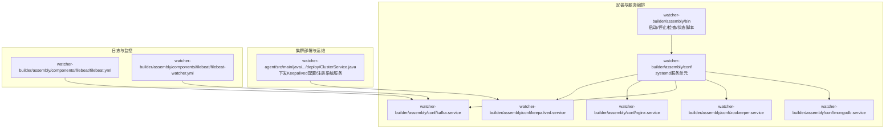
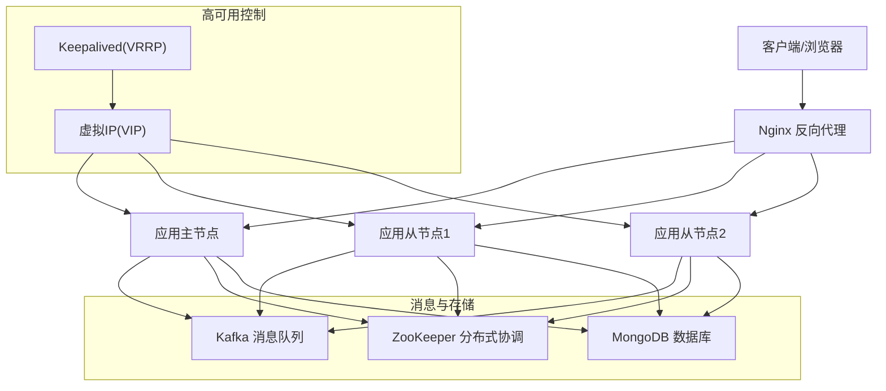
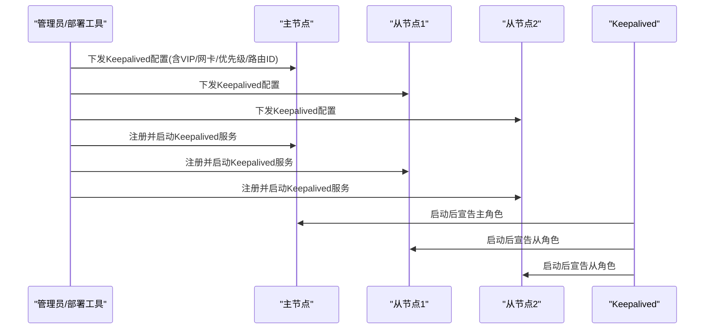
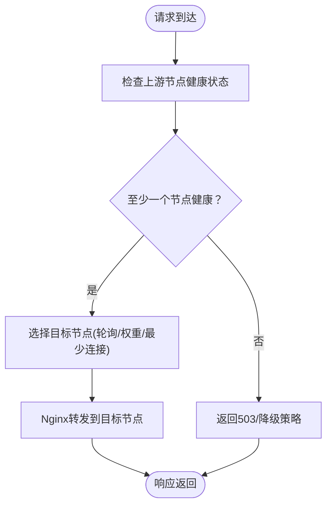
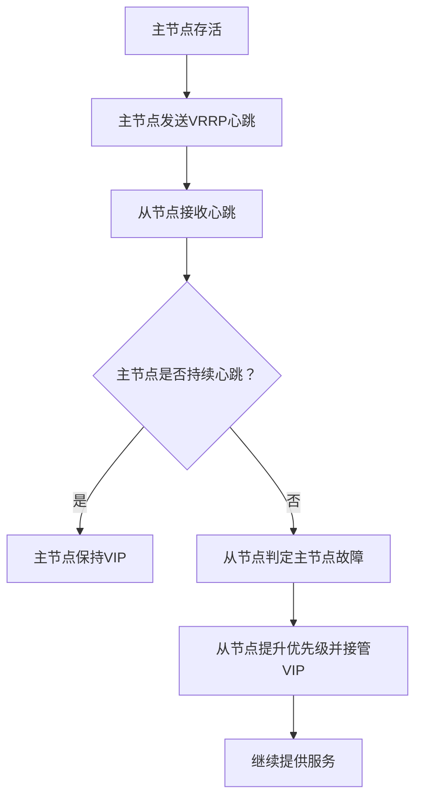
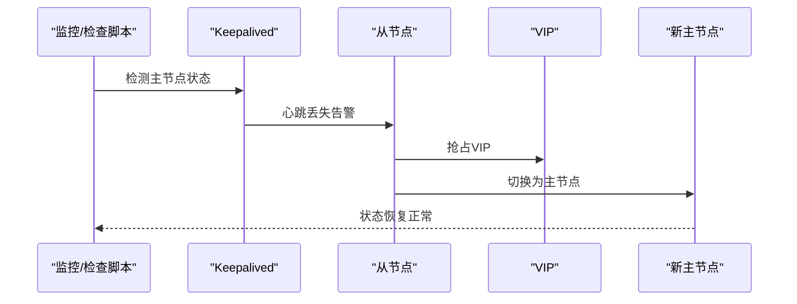
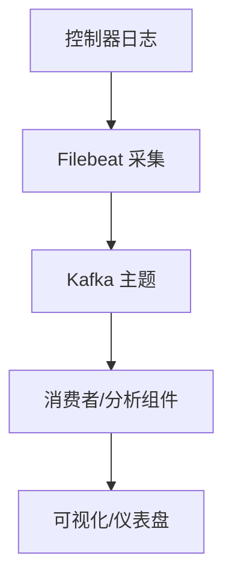
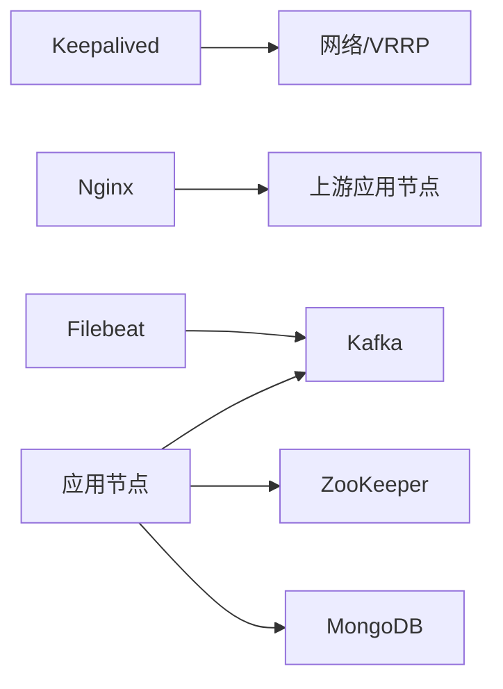

# 高可用架构设计

<cite>
**本文引用的文件**
- [init_slave.sh](file://watcher-builder/assembly/bin/init_slave.sh)
- [startup.sh](file://watcher-builder/assembly/bin/startup.sh)
- [shutdown.sh](file://watcher-builder/assembly/bin/shutdown.sh)
- [check.sh](file://watcher-builder/assembly/bin/check.sh)
- [status.sh](file://watcher-builder/assembly/bin/status.sh)
- [keepalived.service](file://watcher-builder/assembly/conf/keepalived.service)
- [nginx.service](file://watcher-builder/assembly/conf/nginx.service)
- [kafka.service](file://watcher-builder/assembly/conf/kafka.service)
- [zookeeper.service](file://watcher-builder/assembly/conf/zookeeper.service)
- [mongodb.service](file://watcher-builder/assembly/conf/mongodb.service)
- [openfirewalld.sh](file://watcher-builder/assembly/bin/openfirewalld.sh)
- [register_keepalived_as_system_service.sh](file://watcher-builder/assembly/bin/register_keepalived_as_system_service.sh)
- [ClusterService.java](file://watcher-agent/src/main/java/com/virtual/cloud/om/agent/service/deploy/ClusterService.java)
- [filebeat.yml](file://watcher-builder/assembly/components/filebeat/filebeat-8.0.1-linux-x86_64/filebeat.yml)
- [filebeat-watcher.yml](file://watcher-builder/assembly/components/filebeat/filebeat-8.0.1-linux-x86_64/filebeat-watcher.yml)
</cite>

## 目录
1. [简介](#简介)
2. [项目结构](#项目结构)
3. [核心组件](#核心组件)
4. [架构总览](#架构总览)
5. [详细组件分析](#详细组件分析)
6. [依赖关系分析](#依赖关系分析)
7. [性能考虑](#性能考虑)
8. [故障排查指南](#故障排查指南)
9. [结论](#结论)
10. [附录](#附录)

## 简介
本文件面向ShowTime监控系统的高可用架构设计，围绕“主从复制”“负载均衡与虚拟IP漂移”“健康检查与故障转移”“集群通信与一致性保障”“性能监控与容量规划”等主题展开，结合仓库中的安装部署、服务编排与监控采集脚本，给出可落地的设计说明与实施建议。

## 项目结构
本项目采用多模块分层组织，其中与高可用直接相关的关键目录如下：
- watcher-builder：安装打包与系统服务编排（含Nginx、Keepalived、Kafka、ZooKeeper、MongoDB等服务单元）
- watcher-agent：集群部署与运维自动化（含Keepalived配置下发与VIP变更）
- watcher-builder/assembly/components/filebeat：日志采集与转发配置（对接Kafka）

图表来源
- [startup.sh:1-81](file://watcher-builder/assembly/bin/startup.sh#L1-L81)
- [shutdown.sh:1-26](file://watcher-builder/assembly/bin/shutdown.sh#L1-L26)
- [check.sh:1-27](file://watcher-builder/assembly/bin/check.sh#L1-L27)
- [keepalived.service:1-14](file://watcher-builder/assembly/conf/keepalived.service#L1-L14)
- [nginx.service:1-14](file://watcher-builder/assembly/conf/nginx.service#L1-L14)
- [kafka.service:1-14](file://watcher-builder/assembly/conf/kafka.service#L1-L14)
- [zookeeper.service:1-14](file://watcher-builder/assembly/conf/zookeeper.service#L1-L14)
- [mongodb.service:1-14](file://watcher-builder/assembly/conf/mongodb.service#L1-L14)
- [ClusterService.java:239-290](file://watcher-agent/src/main/java/com/virtual/cloud/om/agent/service/deploy/ClusterService.java#L239-L290)
- [filebeat.yml:130-135](file://watcher-builder/assembly/components/filebeat/filebeat-8.0.1-linux-x86_64/filebeat.yml#L130-L135)
- [filebeat-watcher.yml:13-17](file://watcher-builder/assembly/components/filebeat/filebeat-8.0.1-linux-x86_64/filebeat-watcher.yml#L13-L17)

章节来源
- [startup.sh:1-81](file://watcher-builder/assembly/bin/startup.sh#L1-L81)
- [keepalived.service:1-14](file://watcher-builder/assembly/conf/keepalived.service#L1-L14)
- [nginx.service:1-14](file://watcher-builder/assembly/conf/nginx.service#L1-L14)
- [kafka.service:1-14](file://watcher-builder/assembly/conf/kafka.service#L1-L14)
- [zookeeper.service:1-14](file://watcher-builder/assembly/conf/zookeeper.service#L1-L14)
- [mongodb.service:1-14](file://watcher-builder/assembly/conf/mongodb.service#L1-L14)
- [ClusterService.java:239-290](file://watcher-agent/src/main/java/com/virtual/cloud/om/agent/service/deploy/ClusterService.java#L239-L290)
- [filebeat.yml:130-135](file://watcher-builder/assembly/components/filebeat/filebeat-8.0.1-linux-x86_64/filebeat.yml#L130-L135)
- [filebeat-watcher.yml:13-17](file://watcher-builder/assembly/components/filebeat/filebeat-8.0.1-linux-x86_64/filebeat-watcher.yml#L13-L17)

## 核心组件
- 应用进程与守护
  - watcher-agent：以独立进程运行，通过统一入口脚本启动，具备进程标志位用于识别与管理；支持优雅停止。
  - systemd服务单元：为Nginx、Keepalived、Kafka、ZooKeeper、MongoDB分别提供启动/重启/停止能力。
- 负载均衡与高可用
  - Nginx反向代理：作为流量入口，实现请求转发与会话保持策略（需结合具体上游配置）。
  - Keepalived：基于VRRP实现虚拟IP（VIP）漂移，形成主从热备，提升可用性。
- 健康检查与自愈
  - 定时检查脚本：周期性检测关键服务状态，异常时自动尝试启动。
  - 进程状态脚本：快速判断agent运行状态。
- 日志采集与传输
  - Filebeat：采集控制器日志并输出至Kafka，支撑集中式日志与监控。

章节来源
- [startup.sh:70-81](file://watcher-builder/assembly/bin/startup.sh#L70-L81)
- [shutdown.sh:20-26](file://watcher-builder/assembly/bin/shutdown.sh#L20-L26)
- [nginx.service:1-14](file://watcher-builder/assembly/conf/nginx.service#L1-L14)
- [keepalived.service:1-14](file://watcher-builder/assembly/conf/keepalived.service#L1-L14)
- [check.sh:1-27](file://watcher-builder/assembly/bin/check.sh#L1-L27)
- [status.sh:1-10](file://watcher-builder/assembly/bin/status.sh#L1-L10)
- [filebeat.yml:130-135](file://watcher-builder/assembly/components/filebeat/filebeat-8.0.1-linux-x86_64/filebeat.yml#L130-L135)

## 架构总览
下图展示高可用架构中各组件的交互关系与职责划分：

图表来源
- [nginx.service:1-14](file://watcher-builder/assembly/conf/nginx.service#L1-L14)
- [keepalived.service:1-14](file://watcher-builder/assembly/conf/keepalived.service#L1-L14)
- [kafka.service:1-14](file://watcher-builder/assembly/conf/kafka.service#L1-L14)
- [zookeeper.service:1-14](file://watcher-builder/assembly/conf/zookeeper.service#L1-L14)
- [mongodb.service:1-14](file://watcher-builder/assembly/conf/mongodb.service#L1-L14)

## 详细组件分析

### 主从复制与数据同步机制
- 角色分工
  - 主节点：对外提供服务，持有VIP；负责处理业务请求。
  - 从节点：热备状态，监听主节点健康状况；在主节点不可用时接管VIP。
- 数据同步
  - 应用层：通过共享存储或应用内一致性协议保障数据一致性（需结合具体业务实现）。
  - 配置层：通过部署工具下发Keepalived配置，确保各节点网络参数一致。
- 关键实现点
  - 部署阶段修改VIP、网卡、优先级与路由ID，注册为系统服务并启动。
  - 通过防火墙规则放行VRRP组播与业务端口，确保心跳与业务正常。

图表来源
- [ClusterService.java:239-290](file://watcher-agent/src/main/java/com/virtual/cloud/om/agent/service/deploy/ClusterService.java#L239-L290)
- [register_keepalived_as_system_service.sh:1-20](file://watcher-builder/assembly/bin/register_keepalived_as_system_service.sh#L1-L20)
- [keepalived.service:1-14](file://watcher-builder/assembly/conf/keepalived.service#L1-L14)

章节来源
- [ClusterService.java:239-290](file://watcher-agent/src/main/java/com/virtual/cloud/om/agent/service/deploy/ClusterService.java#L239-L290)
- [register_keepalived_as_system_service.sh:1-20](file://watcher-builder/assembly/bin/register_keepalived_as_system_service.sh#L1-L20)
- [keepalived.service:1-14](file://watcher-builder/assembly/conf/keepalived.service#L1-L14)

### 负载均衡策略（Nginx反向代理）
- 入口层：Nginx作为统一入口，将请求分发到多个应用节点。
- 会话与健康：可结合上游健康检查与会话保持策略，避免跨节点状态不一致。
- 服务单元：通过systemd服务单元管理Nginx生命周期。

图表来源
- [nginx.service:1-14](file://watcher-builder/assembly/conf/nginx.service#L1-L14)

章节来源
- [nginx.service:1-14](file://watcher-builder/assembly/conf/nginx.service#L1-L14)

### Keepalived虚拟IP漂移机制
- 心跳与抢占：基于VRRP协议，主节点定期发送心跳；从节点根据优先级与心跳判定主节点状态。
- VIP漂移：主节点故障时，从节点根据优先级抢占VIP，继续对外提供服务。
- 网络与防火墙：需要放行VRRP组播地址与业务端口，确保心跳与业务可达。

图表来源
- [openfirewalld.sh:12-20](file://watcher-builder/assembly/bin/openfirewalld.sh#L12-L20)
- [keepalived.service:1-14](file://watcher-builder/assembly/conf/keepalived.service#L1-L14)

章节来源
- [openfirewalld.sh:1-21](file://watcher-builder/assembly/bin/openfirewalld.sh#L1-L21)
- [keepalived.service:1-14](file://watcher-builder/assembly/conf/keepalived.service#L1-L14)

### 故障转移触发条件与切换流程
- 触发条件
  - 主节点进程不可用或服务异常。
  - Keepalived心跳中断。
- 切换流程
  - 从节点检测到主节点故障，依据优先级抢占VIP。
  - 客户端通过VIP访问新的主节点，实现无感切换。
- 自动恢复
  - 主节点修复后，若其优先级最高且心跳恢复，可重新接管VIP（取决于配置策略）。

图表来源
- [check.sh:1-27](file://watcher-builder/assembly/bin/check.sh#L1-L27)
- [status.sh:1-10](file://watcher-builder/assembly/bin/status.sh#L1-L10)
- [keepalived.service:1-14](file://watcher-builder/assembly/conf/keepalived.service#L1-L14)

章节来源
- [check.sh:1-27](file://watcher-builder/assembly/bin/check.sh#L1-L27)
- [status.sh:1-10](file://watcher-builder/assembly/bin/status.sh#L1-L10)
- [keepalived.service:1-14](file://watcher-builder/assembly/conf/keepalived.service#L1-L14)

### 集群节点间通信协议与一致性
- 协议栈
  - VRRP：用于Keepalived心跳与VIP选举。
  - TCP/UDP：Nginx、Kafka、ZooKeeper、MongoDB等服务使用相应协议。
- 一致性保障
  - 应用层：通过共享存储或应用内一致性协议（如分布式锁、事务日志）保障数据一致性。
  - 配置层：统一下发配置，确保各节点网络参数一致。

章节来源
- [openfirewalld.sh:12-20](file://watcher-builder/assembly/bin/openfirewalld.sh#L12-L20)
- [kafka.service:1-14](file://watcher-builder/assembly/conf/kafka.service#L1-L14)
- [zookeeper.service:1-14](file://watcher-builder/assembly/conf/zookeeper.service#L1-L14)
- [mongodb.service:1-14](file://watcher-builder/assembly/conf/mongodb.service#L1-L14)

### 性能监控与日志采集
- 日志采集
  - Filebeat采集控制器日志并输出到Kafka，便于集中化分析与告警。
- 监控指标
  - 结合Nginx、Kafka、ZooKeeper、MongoDB的内置指标与JVM GC日志，建立多维监控体系。
- 建议
  - 对关键路径进行延迟与吞吐统计，设置阈值告警与自动扩缩容策略。

图表来源
- [filebeat.yml:130-135](file://watcher-builder/assembly/components/filebeat/filebeat-8.0.1-linux-x86_64/filebeat.yml#L130-L135)
- [filebeat-watcher.yml:13-17](file://watcher-builder/assembly/components/filebeat/filebeat-8.0.1-linux-x86_64/filebeat-watcher.yml#L13-L17)

章节来源
- [filebeat.yml:130-135](file://watcher-builder/assembly/components/filebeat/filebeat-8.0.1-linux-x86_64/filebeat.yml#L130-L135)
- [filebeat-watcher.yml:13-17](file://watcher-builder/assembly/components/filebeat/filebeat-8.0.1-linux-x86_64/filebeat-watcher.yml#L13-L17)

## 依赖关系分析
- 组件耦合
  - Keepalived依赖网络与防火墙配置；Nginx依赖上游节点健康状态。
  - Kafka/ZooKeeper/MongoDB为应用提供消息与存储基础能力。
- 外部依赖
  - Linux systemd、VRRP组播、Kafka集群、ZooKeeper集群、MongoDB实例。

图表来源
- [keepalived.service:1-14](file://watcher-builder/assembly/conf/keepalived.service#L1-L14)
- [nginx.service:1-14](file://watcher-builder/assembly/conf/nginx.service#L1-L14)
- [kafka.service:1-14](file://watcher-builder/assembly/conf/kafka.service#L1-L14)
- [zookeeper.service:1-14](file://watcher-builder/assembly/conf/zookeeper.service#L1-L14)
- [mongodb.service:1-14](file://watcher-builder/assembly/conf/mongodb.service#L1-L14)
- [filebeat.yml:130-135](file://watcher-builder/assembly/components/filebeat/filebeat-8.0.1-linux-x86_64/filebeat.yml#L130-L135)

章节来源
- [keepalived.service:1-14](file://watcher-builder/assembly/conf/keepalived.service#L1-L14)
- [nginx.service:1-14](file://watcher-builder/assembly/conf/nginx.service#L1-L14)
- [kafka.service:1-14](file://watcher-builder/assembly/conf/kafka.service#L1-L14)
- [zookeeper.service:1-14](file://watcher-builder/assembly/conf/zookeeper.service#L1-L14)
- [mongodb.service:1-14](file://watcher-builder/assembly/conf/mongodb.service#L1-L14)
- [filebeat.yml:130-135](file://watcher-builder/assembly/components/filebeat/filebeat-8.0.1-linux-x86_64/filebeat.yml#L130-L135)

## 性能考虑
- 资源规划
  - JVM堆大小与GC策略已在agent启动脚本中配置，建议结合实际负载调整内存与GC参数。
  - Nginx并发连接数、worker进程数与事件模型应按峰值QPS调优。
- 存储与网络
  - Kafka/ZooKeeper/MongoDB的磁盘IO与网络带宽需满足峰值写入需求。
- 监控与压测
  - 建立端到端压测方案，覆盖Nginx、应用、消息中间件与数据库链路，观察延迟与错误率拐点。

章节来源
- [startup.sh:60-72](file://watcher-builder/assembly/bin/startup.sh#L60-L72)

## 故障排查指南
- 常见问题定位
  - 进程状态：使用状态脚本确认agent是否运行。
  - 服务状态：检查systemd服务单元是否启用并正常启动。
  - 健康检查：查看定时检查脚本输出，确认关键服务是否被自动修复。
  - 网络与防火墙：确认VRRP组播与业务端口已放行。
- 快速恢复
  - 若主节点异常，确认从节点是否成功接管VIP；必要时手动干预恢复主节点后使其重新参与选举。

章节来源
- [status.sh:1-10](file://watcher-builder/assembly/bin/status.sh#L1-L10)
- [check.sh:1-27](file://watcher-builder/assembly/bin/check.sh#L1-L27)
- [openfirewalld.sh:12-20](file://watcher-builder/assembly/bin/openfirewalld.sh#L12-L20)

## 结论
本设计以Keepalived实现VIP热备，结合Nginx提供统一入口与负载均衡，配合Kafka/ZooKeeper/MongoDB构建消息与存储基础，辅以Filebeat完成日志采集与传输。通过统一的部署与运维脚本，实现配置下发、服务注册与故障自愈，满足高可用与高可靠要求。建议在上线前完成端到端压测与演练，确保在高负载场景下的稳定性与可恢复性。

## 附录
- 部署与运维要点
  - 使用部署工具下发Keepalived配置，修改VIP、网卡、优先级与路由ID，并注册为系统服务。
  - 在所有节点开放VRRP组播与业务端口，确保心跳与业务正常。
  - 通过定时检查脚本与systemd服务单元，实现服务自愈与生命周期管理。

章节来源
- [ClusterService.java:239-290](file://watcher-agent/src/main/java/com/virtual/cloud/om/agent/service/deploy/ClusterService.java#L239-L290)
- [register_keepalived_as_system_service.sh:1-20](file://watcher-builder/assembly/bin/register_keepalived_as_system_service.sh#L1-L20)
- [openfirewalld.sh:12-20](file://watcher-builder/assembly/bin/openfirewalld.sh#L12-L20)
- [keepalived.service:1-14](file://watcher-builder/assembly/conf/keepalived.service#L1-L14)
- [nginx.service:1-14](file://watcher-builder/assembly/conf/nginx.service#L1-L14)
- [kafka.service:1-14](file://watcher-builder/assembly/conf/kafka.service#L1-L14)
- [zookeeper.service:1-14](file://watcher-builder/assembly/conf/zookeeper.service#L1-L14)
- [mongodb.service:1-14](file://watcher-builder/assembly/conf/mongodb.service#L1-L14)
- [check.sh:1-27](file://watcher-builder/assembly/bin/check.sh#L1-L27)
- [status.sh:1-10](file://watcher-builder/assembly/bin/status.sh#L1-L10)