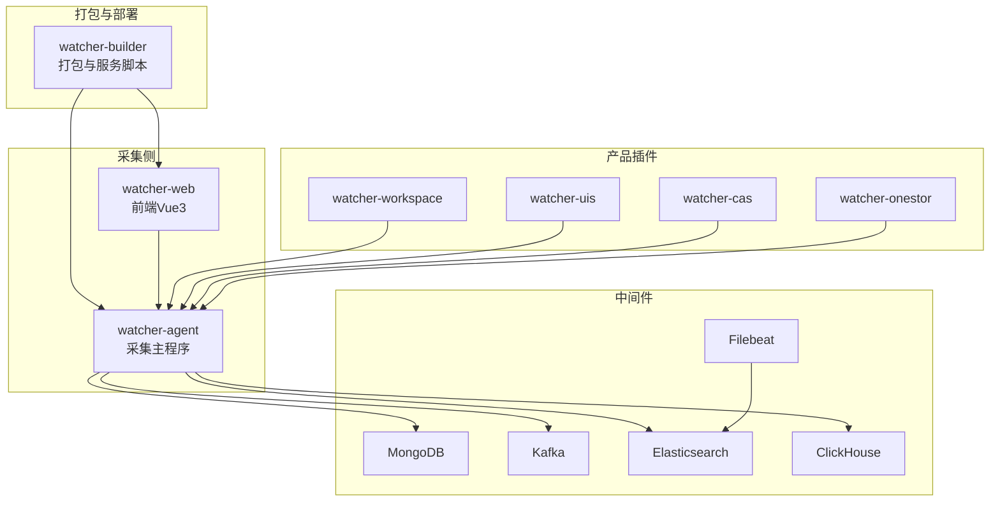
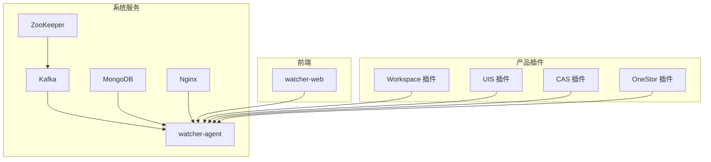
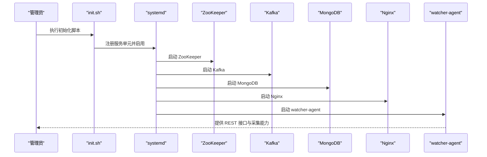
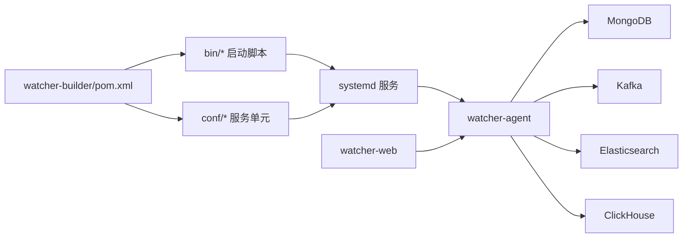
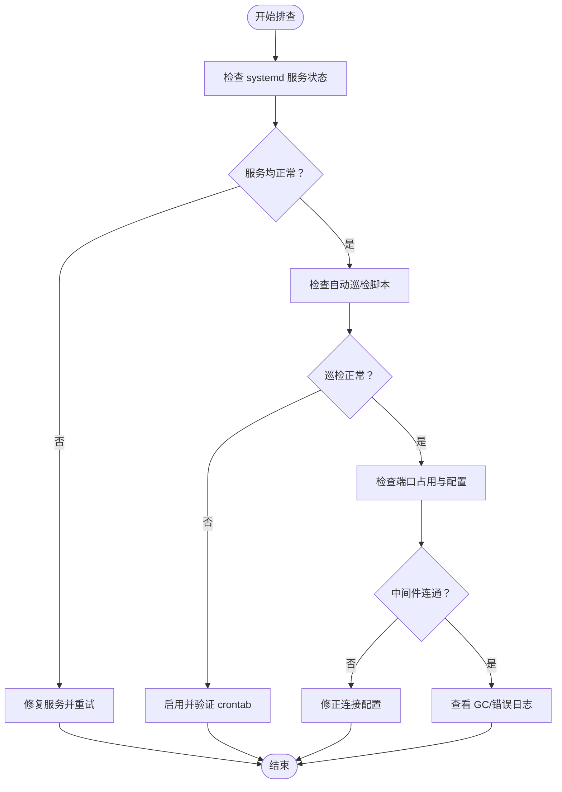

# 快速开始指南

<cite>
**本文引用的文件**
- [Readme.md](file://Readme.md)
- [pom.xml](file://watcher-builder/pom.xml)
- [agent.service](file://watcher-builder/assembly/conf/agent.service)
- [mongodb.service](file://watcher-builder/assembly/conf/mongodb.service)
- [kafka.service](file://watcher-builder/assembly/conf/kafka.service)
- [nginx.service](file://watcher-builder/assembly/conf/nginx.service)
- [zookeeper.service](file://watcher-builder/assembly/conf/zookeeper.service)
- [startup.sh](file://watcher-builder/assembly/bin/startup.sh)
- [init.sh](file://watcher-builder/assembly/bin/init.sh)
- [register_as_system_service_and_start.sh](file://watcher-builder/assembly/bin/register_as_system_service_and_start.sh)
- [check.sh](file://watcher-builder/assembly/bin/check.sh)
- [application.properties](file://watcher-agent/src/main/resources/application.properties)
- [application-prod.properties](file://watcher-agent/src/main/resources/application-prod.properties)
- [schema-mysql.sql](file://watcher-agent/src/main/resources/schema-mysql.sql)
- [menu.ts](file://watcher-web/src/locale/modules/en/menu.ts)
- [.codebuddy 计划文档](file://.codebuddy/plans/ShowTime_Sprint1_开发计划_63935fbd.md)
</cite>

## 目录
1. [简介](#简介)
2. [项目结构](#项目结构)
3. [核心组件](#核心组件)
4. [架构总览](#架构总览)
5. [详细组件分析](#详细组件分析)
6. [依赖关系分析](#依赖关系分析)
7. [性能考虑](#性能考虑)
8. [故障排查指南](#故障排查指南)
9. [结论](#结论)
10. [附录](#附录)

## 简介
本指南面向新手用户，帮助你在最短时间内完成 ShowTime 监控系统的环境准备、软件依赖安装、系统部署与基础使用。系统采用多模块 Maven 架构，核心由采集代理、前端界面、以及可插拔的产品采集模块组成；中间件包括 MongoDB、Kafka、Elasticsearch、ClickHouse 等，支持日志采集、全文检索、指标采集与监控报表。

- 系统目标：围绕“展示（Show）”与“时间序列数据（Time）”提供统一的监控能力，覆盖日志/指标采集、报表与告警。
- 技术栈要点：SpringBoot、Quartz、MongoDB、Elasticsearch、Kafka、Filebeat、Kibana、ClickHouse、Grafana 等。

章节来源
- [Readme.md:1-45](file://Readme.md#L1-L45)

## 项目结构
- watcher-builder：打包与系统服务脚本，负责将各模块产物与依赖整合，并生成 systemd 服务单元与启动脚本。
- watcher-agent：采集主程序与资源管理，提供 REST 接口、定时任务、日志策略下发等。
- watcher-web：前端 Vue3 应用，提供仪表盘、采集节点管理、初始配置等功能页面。
- watcher-sdk：公共 DTO、常量、工具类，供各产品采集模块复用。
- watcher-workspace/cas/uis/onestor：各产品的指标采集与日志解析插件模块。
- performer-service：监控数据查询与展示（ClickHouse）。

图表来源
- [Readme.md:27-45](file://Readme.md#L27-L45)
- [pom.xml:1-212](file://watcher-builder/pom.xml#L1-L212)

章节来源
- [Readme.md:27-45](file://Readme.md#L27-L45)
- [pom.xml:1-212](file://watcher-builder/pom.xml#L1-L212)

## 核心组件
- watcher-builder：通过 Maven 打包阶段将 agent、performer 可执行 JAR、配置与插件复制到统一目录，生成 systemd 服务单元与启动脚本，便于系统级部署与自启动。
- watcher-agent：提供资源管理、定时采集、日志策略下发、与外部产品服务对接（UIS/CAS/Workspace/OneStor）。
- watcher-web：Vue3 前端，菜单包含“采集节点管理”“初始配置”等模块，用于添加监控资源、查看报表、配置告警策略等。
- watcher-sdk：公共 DTO、常量与工具类，支撑跨模块的数据交换与通用逻辑。
- watcher-workspace/cas/uis/onestor：各产品指标采集与日志解析插件，作为 watcher-agent 的插件加载。

章节来源
- [Readme.md:27-45](file://Readme.md#L27-L45)
- [menu.ts:1-23](file://watcher-web/src/locale/modules/en/menu.ts#L1-L23)
- [.codebuddy 计划文档:41-88](file://.codebuddy/plans/ShowTime_Sprint1_开发计划_63935fbd.md#L41-L88)

## 架构总览
下图展示了从采集节点到中间件与前端的整体交互流程，以及系统服务的启动顺序与依赖关系。

图表来源
- [agent.service:1-14](file://watcher-builder/assembly/conf/agent.service#L1-L14)
- [kafka.service:1-14](file://watcher-builder/assembly/conf/kafka.service#L1-L14)
- [mongodb.service:1-14](file://watcher-builder/assembly/conf/mongodb.service#L1-L14)
- [nginx.service:1-14](file://watcher-builder/assembly/conf/nginx.service#L1-L14)
- [zookeeper.service:1-14](file://watcher-builder/assembly/conf/zookeeper.service#L1-L14)
- [register_as_system_service_and_start.sh:17-38](file://watcher-builder/assembly/bin/register_as_system_service_and_start.sh#L17-L38)

## 详细组件分析

### 环境准备与硬件要求
- VirtualBox 虚拟机安装：按照官方安装包进行安装。
- 系统资源建议：至少 4 核 CPU、8 GB 内存，以保证中间件与采集服务稳定运行。
- 网络与防火墙：在初始化脚本中会临时关闭防火墙并开放必要端口，生产环境请按需调整安全策略。

章节来源
- [Readme.md:40-45](file://Readme.md#L40-L45)
- [init.sh:27](file://watcher-builder/assembly/bin/init.sh#L27)

### 软件依赖安装与配置
- JDK：启动脚本会检测 Java 版本，要求 Java 1.8 或以上版本。
- MongoDB：提供 systemd 服务单元与启动脚本，支持独立部署。
- Kafka：提供 systemd 服务单元与启动脚本，依赖 ZooKeeper。
- Nginx：提供 systemd 服务单元与启动脚本，作为反向代理或静态资源服务。
- Elasticsearch：生产配置中包含 ES 地址、认证与超时参数，需提前部署并可用。
- ClickHouse：生产配置中包含 endpoint、用户、密码与数据库，需提前部署并可用。

章节来源
- [startup.sh:3-25](file://watcher-builder/assembly/bin/startup.sh#L3-L25)
- [mongodb.service:1-14](file://watcher-builder/assembly/conf/mongodb.service#L1-L14)
- [kafka.service:1-14](file://watcher-builder/assembly/conf/kafka.service#L1-L14)
- [nginx.service:1-14](file://watcher-builder/assembly/conf/nginx.service#L1-L14)
- [zookeeper.service:1-14](file://watcher-builder/assembly/conf/zookeeper.service#L1-L14)
- [application-prod.properties:3-69](file://watcher-agent/src/main/resources/application-prod.properties#L3-L69)

### 系统部署步骤
- 导入虚拟机镜像：参考 README 中提供的下载链接导入虚拟机。
- 分配硬件资源：建议 4 核 CPU、8 GB 内存。
- 初始化系统：执行初始化脚本，设置 watcher_home、注册系统服务并开启必要端口。
- 启动服务：通过 systemd 启动 ZooKeeper、Kafka、MongoDB、Nginx 与 watcher-agent。
- 连接数据库：MySQL 初始化脚本创建数据库与表结构，用于系统用户、参数、任务、资源、指标与告警等数据存储。

图表来源
- [init.sh:17-28](file://watcher-builder/assembly/bin/init.sh#L17-L28)
- [register_as_system_service_and_start.sh:17-38](file://watcher-builder/assembly/bin/register_as_system_service_and_start.sh#L17-L38)

章节来源
- [Readme.md:40-45](file://Readme.md#L40-L45)
- [init.sh:17-28](file://watcher-builder/assembly/bin/init.sh#L17-L28)
- [register_as_system_service_and_start.sh:17-38](file://watcher-builder/assembly/bin/register_as_system_service_and_start.sh#L17-L38)

### 基础使用示例
- 添加监控资源：通过前端“采集节点管理”页面新增资源，填写平台类型、IP、端口、认证信息等，保存后 watcher-agent 将进行采集。
- 查看监控报表：通过前端“仪表盘”查看指标趋势与概览。
- 配置告警规则：在前端“初始配置”中设置告警策略，结合各产品插件上报的指标与日志进行告警判断。

章节来源
- [menu.ts:13-21](file://watcher-web/src/locale/modules/en/menu.ts#L13-L21)
- [.codebuddy 计划文档:41-59](file://.codebuddy/plans/ShowTime_Sprint1_开发计划_63935fbd.md#L41-L59)

### 数据模型与初始化
- MySQL 初始化脚本包含以下核心表：系统用户、密码策略、Agent 唯一码、部署记录、参数配置、任务、操作日志、数据中心配置、告警记录、资源、指标数据等。
- 建议在部署前先创建数据库与用户，并执行初始化脚本完成表结构与索引创建。

章节来源
- [schema-mysql.sql:1-204](file://watcher-agent/src/main/resources/schema-mysql.sql#L1-L204)

## 依赖关系分析
- watcher-builder 通过 Maven 插件在打包阶段复制 agent/performer 的 JAR、配置与插件到统一目录，并生成 systemd 服务单元与启动脚本。
- watcher-agent 在生产模式下启用 MongoDB/Kafka/Elasticsearch/ClickHouse 等中间件连接，同时加载各产品插件模块。
- watcher-web 通过 REST 接口与 watcher-agent 交互，实现资源管理、报表查看与告警配置。

图表来源
- [pom.xml:15-212](file://watcher-builder/pom.xml#L15-L212)
- [agent.service:1-14](file://watcher-builder/assembly/conf/agent.service#L1-L14)
- [register_as_system_service_and_start.sh:17-38](file://watcher-builder/assembly/bin/register_as_system_service_and_start.sh#L17-L38)

章节来源
- [pom.xml:15-212](file://watcher-builder/pom.xml#L15-L212)
- [application-prod.properties:3-69](file://watcher-agent/src/main/resources/application-prod.properties#L3-L69)

## 性能考虑
- JVM 内存：启动脚本设置了固定堆大小与 GC 日志轮转，建议根据业务规模调整内存参数。
- 中间件性能：Kafka/ZooKeeper/MongoDB/ES/ClickHouse 的连接超时、并发与索引策略需结合实际数据量优化。
- 采集频率：合理设置 Quartz 定时任务与日志采集策略，避免对被监控系统造成压力。

章节来源
- [startup.sh:62-72](file://watcher-builder/assembly/bin/startup.sh#L62-L72)
- [application-prod.properties:21-29](file://watcher-agent/src/main/resources/application-prod.properties#L21-L29)

## 故障排查指南
- 服务未启动：检查 systemd 服务状态，确认 ZooKeeper、Kafka、MongoDB、Nginx、agent 是否正常启动。
- 自动巡检：初始化脚本会写入 crontab，每分钟检查 MongoDB 与 agent 进程，若异常则自动重启。
- 端口冲突：确认中间件端口未被占用，或在配置文件中调整端口。
- 中间件连通性：检查生产配置中的 ES/Kafka/MongoDB/ClickHouse 地址与认证信息是否正确。
- 日志定位：查看 agent 启动脚本生成的 GC 与错误日志路径，定位异常原因。

图表来源
- [register_as_system_service_and_start.sh:23-38](file://watcher-builder/assembly/bin/register_as_system_service_and_start.sh#L23-L38)
- [check.sh:1-27](file://watcher-builder/assembly/bin/check.sh#L1-L27)
- [startup.sh:55-72](file://watcher-builder/assembly/bin/startup.sh#L55-L72)

章节来源
- [register_as_system_service_and_start.sh:23-38](file://watcher-builder/assembly/bin/register_as_system_service_and_start.sh#L23-L38)
- [check.sh:1-27](file://watcher-builder/assembly/bin/check.sh#L1-L27)
- [startup.sh:55-72](file://watcher-builder/assembly/bin/startup.sh#L55-L72)

## 结论
通过本指南，你可以完成 ShowTime 监控系统的环境准备、软件依赖安装、系统部署与基础使用。建议在本地或虚拟机环境中先行验证，再逐步扩展到生产环境。遇到问题时，优先检查 systemd 服务、中间件连通性与日志输出。

## 附录
- 命令行示例（路径引用）
  - 初始化系统：[init.sh:17-28](file://watcher-builder/assembly/bin/init.sh#L17-L28)
  - 注册并启动服务：[register_as_system_service_and_start.sh:17-38](file://watcher-builder/assembly/bin/register_as_system_service_and_start.sh#L17-L38)
  - 启动采集代理：[startup.sh:78](file://watcher-builder/assembly/bin/startup.sh#L78)
  - 自动巡检脚本：[check.sh:1-27](file://watcher-builder/assembly/bin/check.sh#L1-L27)
- 配置文件模板（路径引用）
  - 应用配置（开发/生产）：[application.properties](file://watcher-agent/src/main/resources/application.properties)、[application-prod.properties](file://watcher-agent/src/main/resources/application-prod.properties)
  - MySQL 初始化脚本：[schema-mysql.sql](file://watcher-agent/src/main/resources/schema-mysql.sql)
  - 系统服务单元：[agent.service](file://watcher-builder/assembly/conf/agent.service)、[kafka.service](file://watcher-builder/assembly/conf/kafka.service)、[mongodb.service](file://watcher-builder/assembly/conf/mongodb.service)、[nginx.service](file://watcher-builder/assembly/conf/nginx.service)、[zookeeper.service](file://watcher-builder/assembly/conf/zookeeper.service)