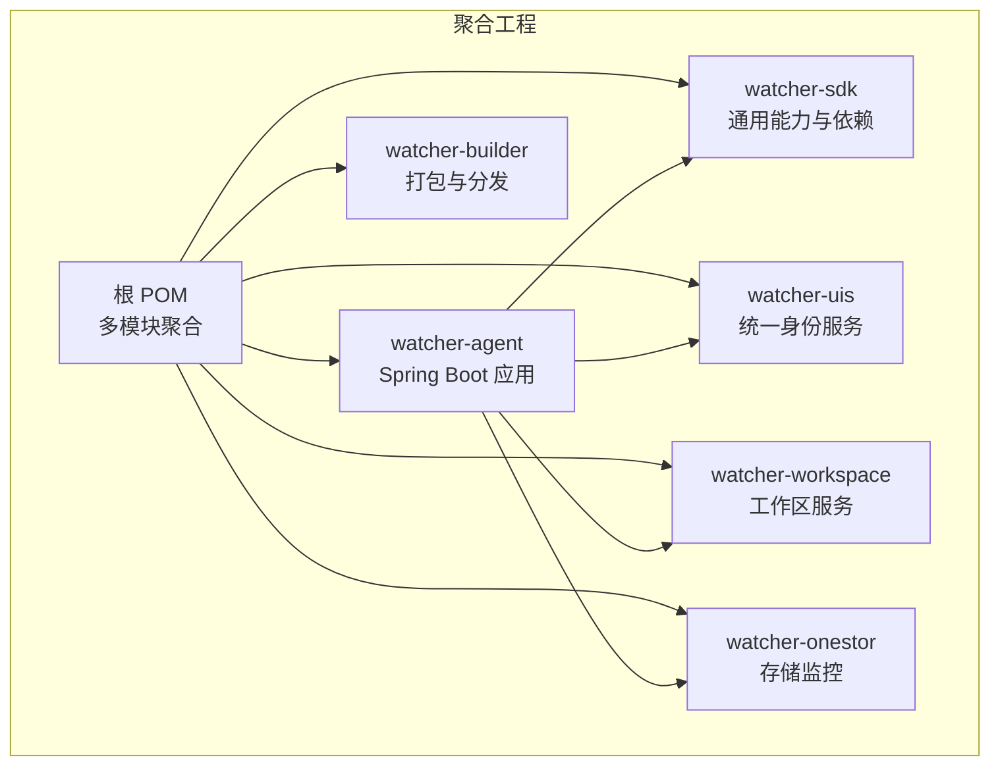
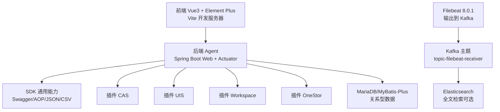
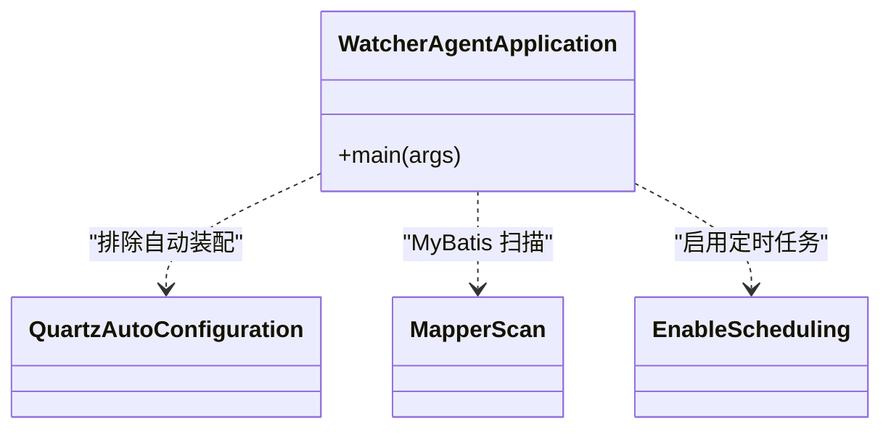
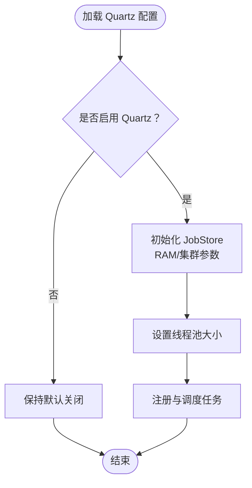
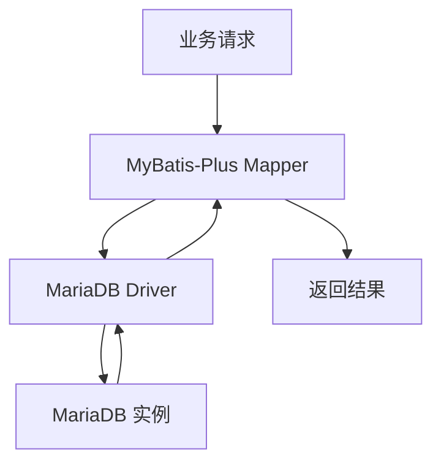
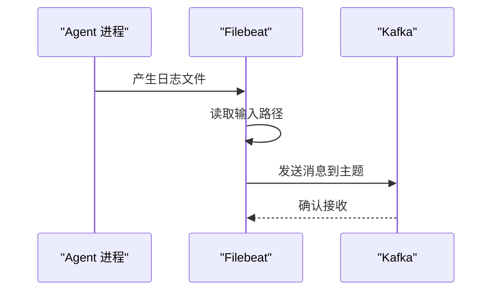
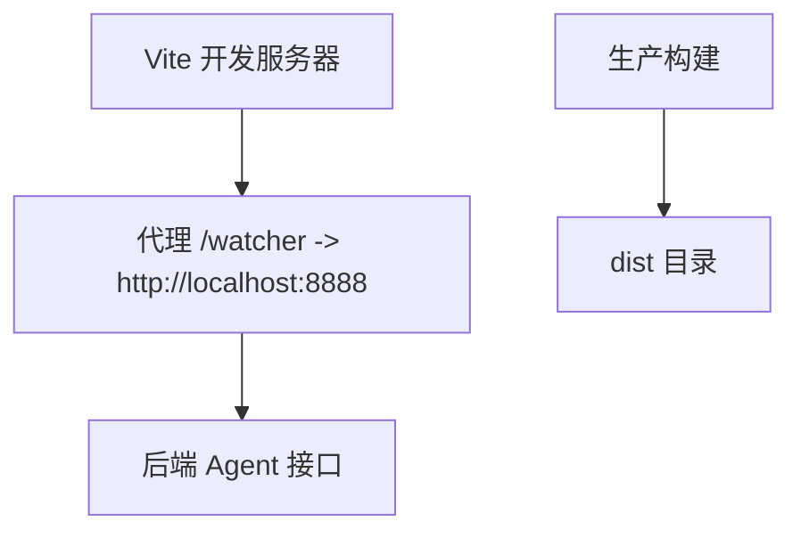
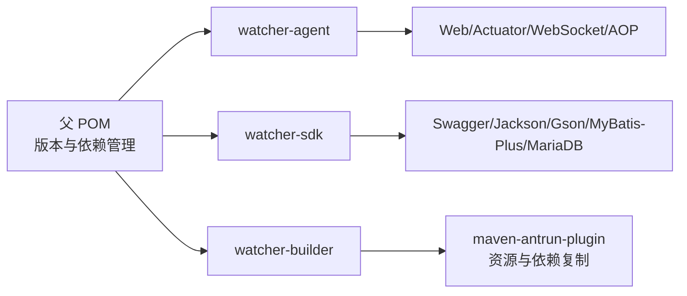

# 技术栈概览

<cite>
**本文引用的文件**
- [pom.xml](file://pom.xml)
- [watcher-agent/pom.xml](file://watcher-agent/pom.xml)
- [watcher-sdk/pom.xml](file://watcher-sdk/pom.xml)
- [watcher-builder/pom.xml](file://watcher-builder/pom.xml)
- [watcher-web/package.json](file://watcher-web/package.json)
- [watcher-web/vite.config.ts](file://watcher-web/vite.config.ts)
- [watcher-agent/src/main/resources/application.properties](file://watcher-agent/src/main/resources/application.properties)
- [watcher-agent/src/main/resources/quartz.properties](file://watcher-agent/src/main/resources/quartz.properties)
- [watcher-agent/src/main/java/com/virtual/cloud/om/agent/WatcherAgentApplication.java](file://watcher-agent/src/main/java/com/virtual/cloud/om/agent/WatcherAgentApplication.java)
- [watcher-builder/assembly/components/filebeat/filebeat-8.0.1-linux-x86_64/filebeat.yml](file://watcher-builder/assembly/components/filebeat/filebeat-8.0.1-linux-x86_64/filebeat.yml)
- [watcher-builder/assembly/components/filebeat/filebeat-8.0.1-linux-x86_64/filebeat-watcher.yml](file://watcher-builder/assembly/components/filebeat/filebeat-8.0.1-linux-x86_64/filebeat-watcher.yml)
</cite>

## 目录
1. [引言](#引言)
2. [项目结构](#项目结构)
3. [核心组件](#核心组件)
4. [架构总览](#架构总览)
5. [详细组件分析](#详细组件分析)
6. [依赖分析](#依赖分析)
7. [性能考虑](#性能考虑)
8. [故障排查指南](#故障排查指南)
9. [结论](#结论)
10. [附录](#附录)

## 引言
本文件面向技术决策者与开发者，系统性梳理 ShowTime 监控系统的全栈技术选型与实现现状。重点覆盖后端 Spring Boot 微服务架构、Quartz 定时调度、MySQL/MariaDB 数据持久化、Elasticsearch 全文检索、Kafka 消息引擎、Filebeat 日志采集、以及前端 Vue3 + Element Plus 技术栈；同时说明当前版本中已移除的组件（如 MongoDB、ClickHouse、旧版 Quartz 存储）与待实现组件（如 Prometheus SDK、TDengine 时序库）。文档提供版本兼容性与依赖关系说明，并给出可操作的优化建议与排障指引。

## 项目结构
ShowTime 采用多模块 Maven 聚合工程组织，包含 Agent、SDK、UI、工作区、构建打包与 AI 辅助模块。Agent 作为核心微服务运行于独立进程，负责采集、策略执行与对外接口；SDK 提供通用能力与依赖；前端通过 Vite 构建并代理后端接口；构建模块负责打包与分发。

图表来源
- [pom.xml:11-18](file://pom.xml#L11-L18)
- [watcher-agent/pom.xml:5-50](file://watcher-agent/pom.xml#L5-L50)
- [watcher-sdk/pom.xml:5-20](file://watcher-sdk/pom.xml#L5-L20)

章节来源
- [pom.xml:11-18](file://pom.xml#L11-L18)
- [watcher-builder/pom.xml:5-20](file://watcher-builder/pom.xml#L5-L20)

## 核心组件
- 后端框架：Spring Boot 2.5.12（基于父 POM 管理），Actuator、Web、Validation、Test 等 Starter。
- 数据持久化：MariaDB 驱动与 MyBatis-Plus，替代原 MongoDB 与 ClickHouse。
- 定时调度：Quartz（默认关闭，保留配置与排除自动装配），支持 RAMJobStore 与集群配置项。
- 消息引擎：Kafka 输出配置（Filebeat），未在后端直接引入 Kafka 客户端。
- 全文检索：Elasticsearch 依赖（SDK），当前 Agent 配置中禁用。
- 日志采集：Filebeat 8.0.1 组件随构建打包，配置输出到 Kafka。
- 前端技术：Vue 3、Element Plus、Vite、Axios、路由与状态管理等生态。

章节来源
- [watcher-agent/pom.xml:54-100](file://watcher-agent/pom.xml#L54-L100)
- [watcher-sdk/pom.xml:97-120](file://watcher-sdk/pom.xml#L97-L120)
- [watcher-agent/src/main/resources/application.properties:14-28](file://watcher-agent/src/main/resources/application.properties#L14-L28)
- [watcher-builder/assembly/components/filebeat/filebeat-8.0.1-linux-x86_64/filebeat.yml:130-150](file://watcher-builder/assembly/components/filebeat/filebeat-8.0.1-linux-x86_64/filebeat.yml#L130-L150)

## 架构总览
系统采用“前端单页应用 + 后端微服务 + 外部中间件”的分层架构。前端通过本地代理访问后端服务；后端通过 SDK 调用插件模块与外部系统；日志通过 Filebeat 发送到 Kafka，供下游消费或写入 ES；定时任务由 Quartz 驱动，当前处于可启用状态但默认关闭。

图表来源
- [watcher-web/vite.config.ts:27-33](file://watcher-web/vite.config.ts#L27-L33)
- [watcher-agent/src/main/resources/application.properties:63-70](file://watcher-agent/src/main/resources/application.properties#L63-L70)
- [watcher-builder/assembly/components/filebeat/filebeat-8.0.1-linux-x86_64/filebeat.yml:130-150](file://watcher-builder/assembly/components/filebeat/filebeat-8.0.1-linux-x86_64/filebeat.yml#L130-L150)

## 详细组件分析

### 后端微服务（Spring Boot）
- 启动类与扫描路径：启用调度注解，排除 Quartz 自动配置，扫描 Agent 与 SDK、插件包。
- Actuator：暴露健康检查与指标，便于运维监控。
- WebSocket：引入 Starter，结合 Java-WebSocket 使用。
- AOP/事务：集成 AspectJ 与 Spring Transaction。

图表来源
- [watcher-agent/src/main/java/com/virtual/cloud/om/agent/WatcherAgentApplication.java:14-18](file://watcher-agent/src/main/java/com/virtual/cloud/om/agent/WatcherAgentApplication.java#L14-L18)

章节来源
- [watcher-agent/src/main/java/com/virtual/cloud/om/agent/WatcherAgentApplication.java:14-27](file://watcher-agent/src/main/java/com/virtual/cloud/om/agent/WatcherAgentApplication.java#L14-L27)
- [watcher-agent/pom.xml:70-90](file://watcher-agent/pom.xml#L70-L90)

### Quartz 定时任务调度
- 当前配置：线程池大小、JobStore 类型、集群参数等保留，便于后续启用。
- 启用方式：通过配置开关与排除自动装配的组合，按需开启。

图表来源
- [watcher-agent/src/main/resources/quartz.properties:15-40](file://watcher-agent/src/main/resources/quartz.properties#L15-L40)
- [watcher-agent/src/main/resources/application.properties:20](file://watcher-agent/src/main/resources/application.properties#L20)

章节来源
- [watcher-agent/src/main/resources/quartz.properties:15-40](file://watcher-agent/src/main/resources/quartz.properties#L15-L40)
- [watcher-agent/src/main/resources/application.properties:14-20](file://watcher-agent/src/main/resources/application.properties#L14-L20)

### 数据持久化（MySQL/MariaDB + MyBatis-Plus）
- 驱动与连接：MariaDB 驱动，MyBatis-Plus Starter。
- 配置：Mapper 映射、驼峰命名、日志实现等。
- 替代方案：原计划的 MongoDB 与 ClickHouse 在当前版本中移除。

图表来源
- [watcher-sdk/pom.xml:99-108](file://watcher-sdk/pom.xml#L99-L108)
- [watcher-agent/src/main/resources/application.properties:48-58](file://watcher-agent/src/main/resources/application.properties#L48-L58)

章节来源
- [watcher-sdk/pom.xml:97-120](file://watcher-sdk/pom.xml#L97-L120)
- [watcher-agent/src/main/resources/application.properties:48-58](file://watcher-agent/src/main/resources/application.properties#L48-L58)

### Elasticsearch 全文检索
- 依赖：SDK 中引入 Elasticsearch 版本属性。
- 当前状态：Agent 配置中禁用，未在运行时启用。

章节来源
- [watcher-sdk/pom.xml:14-16](file://watcher-sdk/pom.xml#L14-L16)
- [watcher-agent/src/main/resources/application.properties:16](file://watcher-agent/src/main/resources/application.properties#L16)

### Kafka 消息引擎
- Filebeat 输出：配置 Kafka 主机与主题，用于日志传输。
- 后端未直接引入 Kafka 客户端，消息通道由 Filebeat 承担。

章节来源
- [watcher-builder/assembly/components/filebeat/filebeat-8.0.1-linux-x86_64/filebeat.yml:132-135](file://watcher-builder/assembly/components/filebeat/filebeat-8.0.1-linux-x86_64/filebeat.yml#L132-L135)

### Filebeat 日志采集
- 组件：随构建打包的 Filebeat 8.0.1。
- 配置：输入路径、模块、Kafka 输出主题等。
- 用途：将控制器日志发送至 Kafka，供下游处理。

图表来源
- [watcher-builder/assembly/components/filebeat/filebeat-8.0.1-linux-x86_64/filebeat-watcher.yml:14-16](file://watcher-builder/assembly/components/filebeat/filebeat-8.0.1-linux-x86_64/filebeat-watcher.yml#L14-L16)

章节来源
- [watcher-builder/assembly/components/filebeat/filebeat-8.0.1-linux-x86_64/filebeat.yml:22-30](file://watcher-builder/assembly/components/filebeat/filebeat-8.0.1-linux-x86_64/filebeat.yml#L22-L30)
- [watcher-builder/assembly/components/filebeat/filebeat-8.0.1-linux-x86_64/filebeat-watcher.yml:14-16](file://watcher-builder/assembly/components/filebeat/filebeat-8.0.1-linux-x86_64/filebeat-watcher.yml#L14-L16)

### 前端技术栈（Vue3 + Element Plus）
- 构建：Vite，开发服务器端口 9090，本地代理后端 /watcher。
- 依赖：Vue 3、Element Plus、Axios、路由与状态管理、图表库 ECharts 等。
- 国际化：vue-i18n v9，多语言资源按模块组织。

图表来源
- [watcher-web/vite.config.ts:23-33](file://watcher-web/vite.config.ts#L23-L33)

章节来源
- [watcher-web/package.json:20-54](file://watcher-web/package.json#L20-L54)
- [watcher-web/vite.config.ts:13-48](file://watcher-web/vite.config.ts#L13-L48)

## 依赖分析
- 版本管理：父 POM 统一管理 Spring Boot、Commons、HTTP 客户端、JWT、MyBatis-Plus、MariaDB 等版本。
- Agent 依赖：Web、Actuator、WebSocket、AOP、YAML、Gson、Validation、Test 等。
- SDK 依赖：Swagger/Knife4j、Jackson/Gson、CSV 解析、MyBatis-Plus、MariaDB 驱动等。
- 构建：Maven 插件复制资源与依赖，生成打包产物。

图表来源
- [pom.xml:22-47](file://pom.xml#L22-L47)
- [watcher-agent/pom.xml:54-136](file://watcher-agent/pom.xml#L54-L136)
- [watcher-sdk/pom.xml:97-160](file://watcher-sdk/pom.xml#L97-L160)
- [watcher-builder/pom.xml:16-207](file://watcher-builder/pom.xml#L16-L207)

章节来源
- [pom.xml:22-47](file://pom.xml#L22-L47)
- [watcher-agent/pom.xml:54-136](file://watcher-agent/pom.xml#L54-L136)
- [watcher-sdk/pom.xml:97-160](file://watcher-sdk/pom.xml#L97-L160)
- [watcher-builder/pom.xml:16-207](file://watcher-builder/pom.xml#L16-L207)

## 性能考虑
- 定时任务：线程池规模适配采集负载，避免阻塞与抖动；集群模式下注意任务幂等与去重。
- 数据库：合理分页与索引设计，避免大查询；批量写入与事务边界控制。
- 日志传输：Filebeat 输出并发与缓冲区配置，Kafka 分区数与副本策略。
- 前端：静态资源拆分与懒加载，减少首屏体积；代理仅限开发环境。

## 故障排查指南
- 启动失败（插件/中间件占位）：确认占位配置与实际服务地址一致，避免启动校验失败。
- Quartz 未生效：检查开关与排除自动装配配置，确认线程池与 JobStore 参数。
- 数据库连接：核对驱动版本、URL、账号密码与字符集设置。
- Filebeat 无法发送：检查 Kafka 地址与主题权限，确认日志路径与模块配置。
- 前端代理无效：确认 Vite 代理规则与后端上下文路径一致。

章节来源
- [watcher-agent/src/main/resources/application.properties:30-40](file://watcher-agent/src/main/resources/application.properties#L30-L40)
- [watcher-agent/src/main/resources/application.properties:14-20](file://watcher-agent/src/main/resources/application.properties#L14-L20)
- [watcher-agent/src/main/resources/application.properties:48-58](file://watcher-agent/src/main/resources/application.properties#L48-L58)
- [watcher-builder/assembly/components/filebeat/filebeat-8.0.1-linux-x86_64/filebeat.yml:132-135](file://watcher-builder/assembly/components/filebeat/filebeat-8.0.1-linux-x86_64/filebeat.yml#L132-L135)
- [watcher-web/vite.config.ts:27-33](file://watcher-web/vite.config.ts#L27-L33)

## 结论
ShowTime 当前以 Spring Boot 为核心，结合 MariaDB/MyBatis-Plus 实现稳定的数据层，通过 Filebeat/Kafka 形成日志采集与传输链路，前端采用 Vue3 + Element Plus 快速迭代。Quartz 与 Elasticsearch 处于可启用状态，便于后续扩展。整体技术栈清晰、模块边界明确，具备良好的可维护性与扩展性。

## 附录
- 待实现组件
  - Prometheus SDK：用于指标采集与导出，建议在 Agent 中引入 Micrometer 与 Prometheus 导出器。
  - TDengine 时序数据库：若需时序数据存储，可在 SDK 中引入 TDengine JDBC/驱动，并在 Agent 中新增对应数据源与写入逻辑。
- 版本兼容性要点
  - Java：父 POM 使用 1.8，建议评估升级至 17+ 以获得更好的性能与特性。
  - Spring Boot：2.5.12，建议关注官方更新与安全补丁。
  - Vue3：Node >= 14.19，与 Vite 生态兼容良好。
  - Filebeat：8.0.1，注意与 Kafka/ES 的版本匹配。