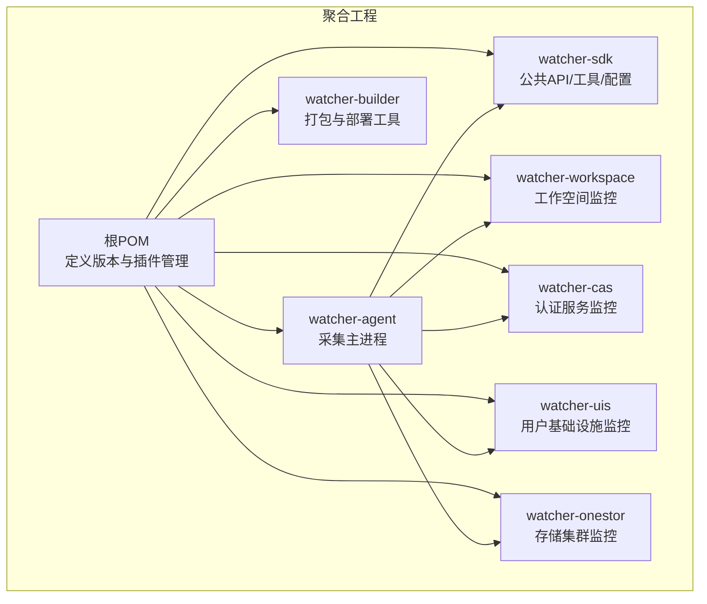
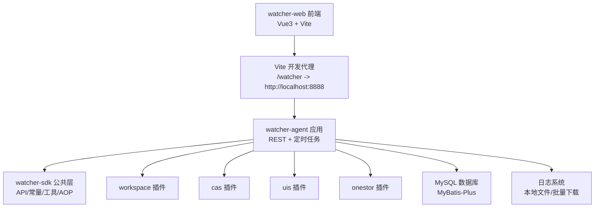
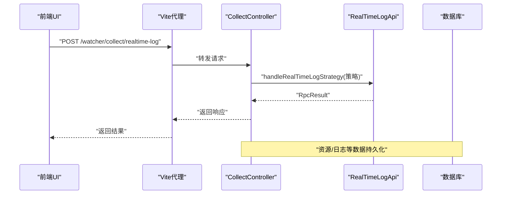
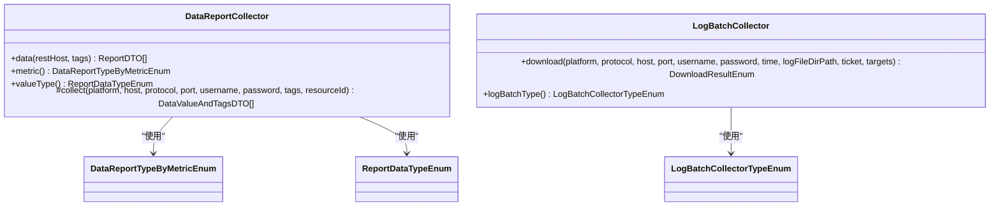
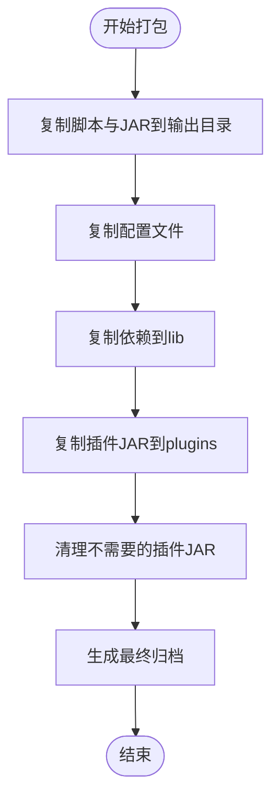
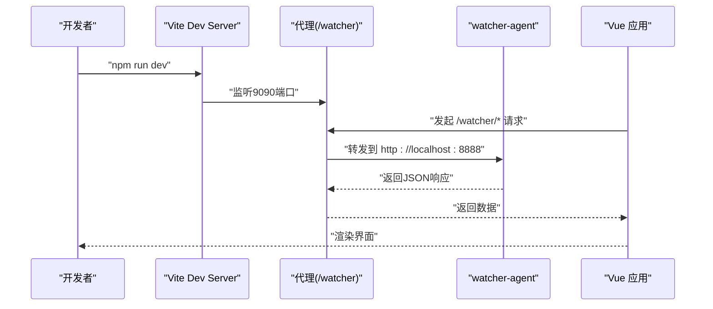
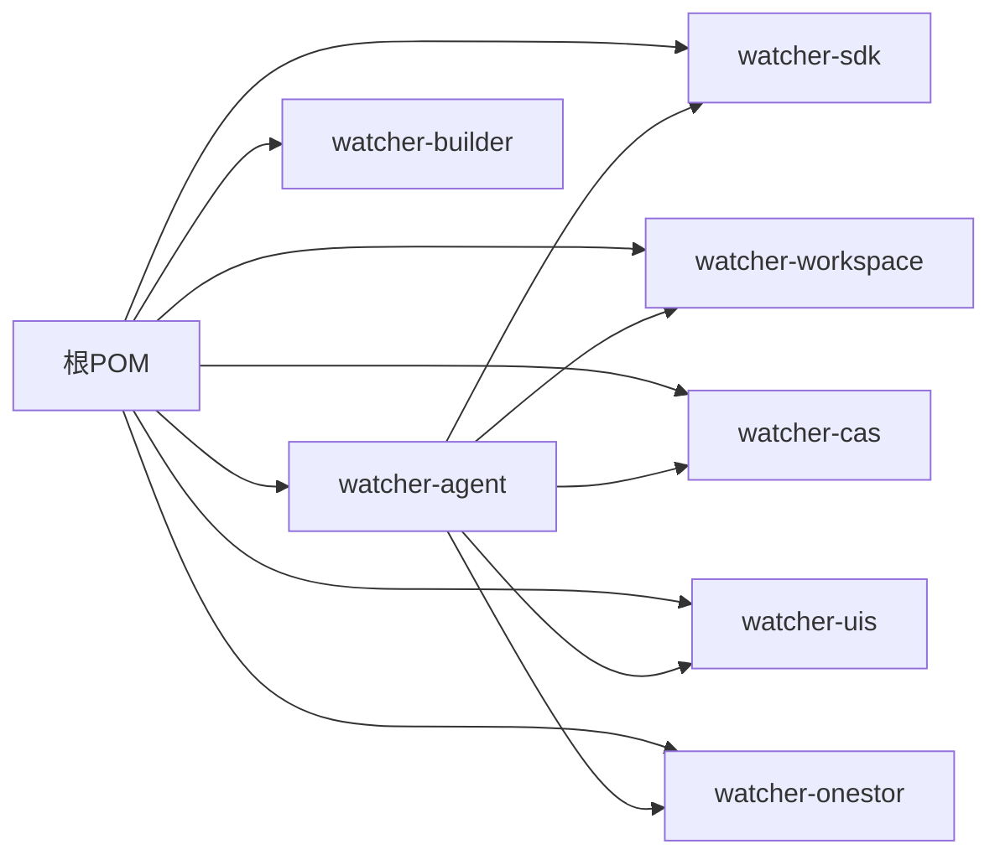

# 系统架构总览

<cite>
**本文引用的文件**
- [pom.xml](file://pom.xml)
- [watcher-agent/src/main/java/com/virtual/cloud/om/agent/WatcherAgentApplication.java](file://watcher-agent/src/main/java/com/virtual/cloud/om/agent/WatcherAgentApplication.java)
- [watcher-agent/src/main/resources/application.properties](file://watcher-agent/src/main/resources/application.properties)
- [watcher-agent/src/main/java/com/virtual/cloud/om/agent/controller/CollectController.java](file://watcher-agent/src/main/java/com/virtual/cloud/om/agent/controller/CollectController.java)
- [watcher-agent/src/main/java/com/virtual/cloud/om/agent/controller/ResourceController.java](file://watcher-agent/src/main/java/com/virtual/cloud/om/agent/controller/ResourceController.java)
- [watcher-agent/src/main/java/com/virtual/cloud/om/agent/controller/LogController.java](file://watcher-agent/src/main/java/com/virtual/cloud/om/agent/controller/LogController.java)
- [watcher-builder/pom.xml](file://watcher-builder/pom.xml)
- [watcher-builder/assembly/bin/startup.sh](file://watcher-builder/assembly/bin/startup.sh)
- [watcher-sdk/pom.xml](file://watcher-sdk/pom.xml)
- [watcher-sdk/src/main/java/com/virtual/cloud/om/sdk/api/DataReportCollector.java](file://watcher-sdk/src/main/java/com/virtual/cloud/om/sdk/api/DataReportCollector.java)
- [watcher-sdk/src/main/java/com/virtual/cloud/om/sdk/api/LogBatchCollector.java](file://watcher-sdk/src/main/java/com/virtual/cloud/om/sdk/api/LogBatchCollector.java)
- [watcher-workspace/pom.xml](file://watcher-workspace/pom.xml)
- [watcher-cas/pom.xml](file://watcher-cas/pom.xml)
- [watcher-uis/pom.xml](file://watcher-uis/pom.xml)
- [watcher-onestor/pom.xml](file://watcher-onestor/pom.xml)
- [watcher-web/package.json](file://watcher-web/package.json)
- [watcher-web/vite.config.ts](file://watcher-web/vite.config.ts)
- [watcher-web/src/main.ts](file://watcher-web/src/main.ts)
</cite>

## 目录
1. [引言](#引言)
2. [项目结构](#项目结构)
3. [核心组件](#核心组件)
4. [架构总览](#架构总览)
5. [详细组件分析](#详细组件分析)
6. [依赖分析](#依赖分析)
7. [性能考量](#性能考量)
8. [故障排查指南](#故障排查指南)
9. [结论](#结论)
10. [附录](#附录)

## 引言
本文件面向ShowTime监控系统，提供系统架构总览与关键实现细节。重点阐述两大核心架构：performer单体多模块服务与watcher单体多模块服务；详解watcher-agent作为采集程序主入口的职责（资源管理、定时指标采集、日志收集策略下发等）；梳理公共模块设计理念（watcher-builder打包工具、watcher-workspace/cas/uis/onestor各产品线监控模块、watcher-sdk公共配置与工具类）；并给出watcher-web前端服务的技术架构与模块交互关系。同时，结合微服务架构优势与设计取舍，帮助读者从宏观到微观全面理解系统。

## 项目结构
ShowTime采用多模块Maven聚合工程组织，根POM定义了统一版本与插件管理，子模块按功能域拆分，形成“watcher单体多模块”与“performer单体多模块”的双轨架构。watcher-agent作为采集主进程，加载watcher-sdk与各产品线插件（workspace、cas、uis、onestor），通过配置中心与数据库完成运行期装配。

图表来源
- [pom.xml:11-20](file://pom.xml#L11-L20)
- [watcher-builder/pom.xml:5-13](file://watcher-builder/pom.xml#L5-L13)
- [watcher-sdk/pom.xml:14-16](file://watcher-sdk/pom.xml#L14-L16)
- [watcher-workspace/pom.xml:14-29](file://watcher-workspace/pom.xml#L14-L29)
- [watcher-cas/pom.xml:1-45](file://watcher-cas/pom.xml#L1-L45)
- [watcher-uis/pom.xml:1-45](file://watcher-uis/pom.xml#L1-L45)
- [watcher-onestor/pom.xml:1-45](file://watcher-onestor/pom.xml#L1-L45)

章节来源
- [pom.xml:11-20](file://pom.xml#L11-L20)
- [watcher-builder/pom.xml:5-13](file://watcher-builder/pom.xml#L5-L13)

## 核心组件
- watcher-agent采集主进程：Spring Boot应用入口，启用调度与MyBatis Mapper扫描，加载watcher-sdk与多产品线插件，提供资源、日志、采集等REST接口。
- watcher-sdk公共模块：封装通用API、常量、DTO、工具类、线程池与AOP切面，为各产品线采集器提供统一能力。
- watcher-builder打包工具：负责将agent与各插件JAR、配置、脚本整合为可部署产物，支持watcher与performer两套产物。
- watcher-*产品线模块：workspace/cas/uis/onestor分别实现特定领域的指标采集与日志解析策略。
- watcher-web前端：Vue3 + TypeScript + Vite，通过代理访问后端watcher-agent，提供资源管理、采集策略、日志检索等界面。

章节来源
- [watcher-agent/src/main/java/com/virtual/cloud/om/agent/WatcherAgentApplication.java:14-18](file://watcher-agent/src/main/java/com/virtual/cloud/om/agent/WatcherAgentApplication.java#L14-L18)
- [watcher-agent/src/main/resources/application.properties:1-80](file://watcher-agent/src/main/resources/application.properties#L1-L80)
- [watcher-sdk/pom.xml:14-16](file://watcher-sdk/pom.xml#L14-L16)
- [watcher-builder/pom.xml:15-212](file://watcher-builder/pom.xml#L15-L212)
- [watcher-web/package.json:1-72](file://watcher-web/package.json#L1-L72)

## 架构总览
下图展示watcher单体多模块架构与核心交互：watcher-agent作为控制平面与执行平面的枢纽，通过SDK抽象与产品线插件协作；前端通过代理访问后端接口；打包工具负责构建与发布。

图表来源
- [watcher-web/vite.config.ts:27-33](file://watcher-web/vite.config.ts#L27-L33)
- [watcher-agent/src/main/java/com/virtual/cloud/om/agent/WatcherAgentApplication.java:14-18](file://watcher-agent/src/main/java/com/virtual/cloud/om/agent/WatcherAgentApplication.java#L14-L18)
- [watcher-agent/src/main/resources/application.properties:48-58](file://watcher-agent/src/main/resources/application.properties#L48-L58)
- [watcher-sdk/pom.xml:24-48](file://watcher-sdk/pom.xml#L24-L48)
- [watcher-workspace/pom.xml:22-29](file://watcher-workspace/pom.xml#L22-L29)
- [watcher-cas/pom.xml:1-45](file://watcher-cas/pom.xml#L1-L45)
- [watcher-uis/pom.xml:1-45](file://watcher-uis/pom.xml#L1-L45)
- [watcher-onestor/pom.xml:1-45](file://watcher-onestor/pom.xml#L1-L45)

## 详细组件分析

### watcher-agent：采集主入口
- 启动与装配
  - Spring Boot入口启用调度与Mapper扫描，组件扫描覆盖agent与多个产品线包，便于在运行期动态装配插件。
  - 应用上下文暴露静态引用，便于工具类或非IoC场景使用。
- 配置与中间件
  - 关闭中间件与插件开关（如Elasticsearch、Kafka、MongoDB、Quartz、各产品线REST客户端），以适配单机版MySQL部署。
  - 数据源指向MariaDB，MyBatis-Plus配置驼峰映射与Mapper扫描路径。
- 控制器职责
  - 资源管理：提供资源增删改查、批量导入、可用性与远程权限更新等接口。
  - 日志采集：接收实时日志策略下发请求，转发至SDK日志API；提供日志检索接口。
  - 采集编排：接收批量部署与资源同步请求，委托SDK与产品线服务执行。

图表来源
- [watcher-web/vite.config.ts:27-33](file://watcher-web/vite.config.ts#L27-L33)
- [watcher-agent/src/main/java/com/virtual/cloud/om/agent/controller/CollectController.java:45-51](file://watcher-agent/src/main/java/com/virtual/cloud/om/agent/controller/CollectController.java#L45-L51)
- [watcher-agent/src/main/resources/application.properties:48-58](file://watcher-agent/src/main/resources/application.properties#L48-L58)

章节来源
- [watcher-agent/src/main/java/com/virtual/cloud/om/agent/WatcherAgentApplication.java:14-18](file://watcher-agent/src/main/java/com/virtual/cloud/om/agent/WatcherAgentApplication.java#L14-L18)
- [watcher-agent/src/main/resources/application.properties:14-70](file://watcher-agent/src/main/resources/application.properties#L14-L70)
- [watcher-agent/src/main/java/com/virtual/cloud/om/agent/controller/ResourceController.java:67-96](file://watcher-agent/src/main/java/com/virtual/cloud/om/agent/controller/ResourceController.java#L67-L96)
- [watcher-agent/src/main/java/com/virtual/cloud/om/agent/controller/LogController.java:27-34](file://watcher-agent/src/main/java/com/virtual/cloud/om/agent/controller/LogController.java#L27-L34)
- [watcher-agent/src/main/java/com/virtual/cloud/om/agent/controller/CollectController.java:53-65](file://watcher-agent/src/main/java/com/virtual/cloud/om/agent/controller/CollectController.java#L53-L65)

### watcher-sdk：公共模块与抽象
- 设计理念
  - 提供统一的数据上报采集抽象（DataReportCollector）、日志批量采集接口（LogBatchCollector）与通用DTO、常量、工具类。
  - 封装线程池、AOP切面与异常处理，降低产品线重复实现成本。
- 关键抽象
  - DataReportCollector：定义采集流程骨架（设置时间戳、组装ReportDTO），子类仅实现具体采集逻辑。
  - LogBatchCollector：定义批量日志下载策略与结果枚举，统一返回语义。
- 依赖与版本
  - 依赖Spring Web、AOP、Swagger、Jackson/Gson、MyBatis-Plus、Hutool等，适配Java 8。

图表来源
- [watcher-sdk/src/main/java/com/virtual/cloud/om/sdk/api/DataReportCollector.java:18-118](file://watcher-sdk/src/main/java/com/virtual/cloud/om/sdk/api/DataReportCollector.java#L18-L118)
- [watcher-sdk/src/main/java/com/virtual/cloud/om/sdk/api/LogBatchCollector.java:6-32](file://watcher-sdk/src/main/java/com/virtual/cloud/om/sdk/api/LogBatchCollector.java#L6-L32)

章节来源
- [watcher-sdk/pom.xml:14-16](file://watcher-sdk/pom.xml#L14-L16)
- [watcher-sdk/src/main/java/com/virtual/cloud/om/sdk/api/DataReportCollector.java:48-86](file://watcher-sdk/src/main/java/com/virtual/cloud/om/sdk/api/DataReportCollector.java#L48-L86)
- [watcher-sdk/src/main/java/com/virtual/cloud/om/sdk/api/LogBatchCollector.java:12-18](file://watcher-sdk/src/main/java/com/virtual/cloud/om/sdk/api/LogBatchCollector.java#L12-L18)

### watcher-builder：打包与部署
- 功能定位
  - 将watcher-agent与performer-service的JAR、配置、脚本、插件复制到统一输出目录，生成可部署归档。
  - 在打包阶段剔除不需要的插件JAR，避免运行时冲突。
- 启动脚本
  - startup.sh负责Java版本检测、设置日志目录、JVM参数与GC配置，通过-Dloader.path加载lib、plugins、conf，以prod模式启动agent.jar。

图表来源
- [watcher-builder/pom.xml:25-205](file://watcher-builder/pom.xml#L25-L205)
- [watcher-builder/assembly/bin/startup.sh:15-78](file://watcher-builder/assembly/bin/startup.sh#L15-L78)

章节来源
- [watcher-builder/pom.xml:15-212](file://watcher-builder/pom.xml#L15-L212)
- [watcher-builder/assembly/bin/startup.sh:1-81](file://watcher-builder/assembly/bin/startup.sh#L1-L81)

### watcher-web：前端技术架构
- 技术栈
  - Vue 3 + TypeScript + Vite，Element Plus UI框架，Vuex状态管理，Vue Router路由，国际化(i18n)，Axios网络请求。
- 开发与构建
  - 本地开发服务器监听9090端口，通过代理将/wacher前缀请求转发至后端8888端口。
  - 构建产物输出到dist目录，按需拆分echarts等大依赖。
- 初始化与挂载
  - 应用初始化时注册全局事件总线、Element Plus主题、国际化与指令，最后挂载到DOM。

图表来源
- [watcher-web/vite.config.ts:23-33](file://watcher-web/vite.config.ts#L23-L33)
- [watcher-web/src/main.ts:24-36](file://watcher-web/src/main.ts#L24-L36)
- [watcher-web/package.json:4-9](file://watcher-web/package.json#L4-L9)

章节来源
- [watcher-web/package.json:1-72](file://watcher-web/package.json#L1-L72)
- [watcher-web/vite.config.ts:13-49](file://watcher-web/vite.config.ts#L13-L49)
- [watcher-web/src/main.ts:1-37](file://watcher-web/src/main.ts#L1-L37)

### watcher-*产品线模块：扩展与复用
- 模块职责
  - workspace：工作空间相关资源与操作的采集与报告。
  - cas：认证服务日志与性能监控。
  - uis：用户基础设施相关指标与日志。
  - onestor：存储集群（Ceph/RBD等）基础与监控指标采集。
- 与SDK协作
  - 通过watcher-sdk提供的统一API与抽象，实现各自领域的采集器，保持一致的上报格式与错误处理。

章节来源
- [watcher-workspace/pom.xml:14-29](file://watcher-workspace/pom.xml#L14-L29)
- [watcher-cas/pom.xml:1-45](file://watcher-cas/pom.xml#L1-L45)
- [watcher-uis/pom.xml:1-45](file://watcher-uis/pom.xml#L1-L45)
- [watcher-onestor/pom.xml:1-45](file://watcher-onestor/pom.xml#L1-L45)

## 依赖分析
- 聚合与继承
  - 根POM集中管理Spring Boot版本与常用依赖，子模块按需引入watcher-sdk与自身业务依赖。
- 运行期依赖
  - watcher-agent依赖watcher-sdk与各产品线模块，通过组件扫描与配置加载实现插件化装配。
  - watcher-builder通过Maven插件在打包阶段整合JAR、配置与脚本。
- 数据与中间件
  - 当前单机版禁用中间件与插件开关，数据源为MariaDB，MyBatis-Plus负责ORM。

图表来源
- [pom.xml:49-108](file://pom.xml#L49-L108)
- [watcher-sdk/pom.xml:24-48](file://watcher-sdk/pom.xml#L24-L48)
- [watcher-builder/pom.xml:15-212](file://watcher-builder/pom.xml#L15-L212)

章节来源
- [pom.xml:49-108](file://pom.xml#L49-L108)
- [watcher-builder/pom.xml:15-212](file://watcher-builder/pom.xml#L15-L212)

## 性能考量
- 线程与并发
  - watcher-sdk提供线程池与拒绝策略实现，建议在产品线采集器中复用，避免频繁创建线程导致抖动。
- I/O与日志
  - 批量日志采集应限制并发与单次下载大小，结合DownloadResultEnum进行部分成功重试。
- 数据库
  - MyBatis-Plus开启驼峰映射与Mapper扫描，建议对高频查询建立索引，避免全表扫描。
- 前端
  - 构建时按需拆分大依赖（如echarts），减少首屏体积；开发代理仅转发必要路径，降低跨域与额外开销。

## 故障排查指南
- 启动与配置
  - 若启动失败，检查application.properties中的数据源URL、用户名密码与驱动类名是否正确。
  - 确认中间件与插件开关已按单机版要求关闭，避免启动阻塞。
- 日志与采集
  - 通过startup.sh设置的日志目录查看GC与堆转储日志，定位内存问题。
  - 使用前端代理确认/wacher路径转发是否正常，后端接口返回是否为预期JSON。
- 资源与权限
  - 资源创建/更新失败时，关注加密字段（如CI、密码）是否正确入库；远程权限变更需核对结束时间字段逻辑。

章节来源
- [watcher-agent/src/main/resources/application.properties:48-70](file://watcher-agent/src/main/resources/application.properties#L48-L70)
- [watcher-builder/assembly/bin/startup.sh:55-78](file://watcher-builder/assembly/bin/startup.sh#L55-L78)
- [watcher-web/vite.config.ts:27-33](file://watcher-web/vite.config.ts#L27-L33)

## 结论
ShowTime监控系统采用“watcher单体多模块”架构，以watcher-agent为核心，通过watcher-sdk抽象公共能力，配合watcher-builder实现标准化打包与部署。该架构在保证功能解耦的同时，降低了重复实现成本，便于快速扩展新的产品线监控模块。前端watcher-web通过代理与后端解耦，提升开发体验与维护效率。整体设计兼顾可扩展性与可运维性，适合在多产品线、多采集场景下持续演进。

## 附录
- 微服务架构优势与设计考虑
  - 优势：模块边界清晰、技术栈可选、独立演进、故障隔离、团队自治。
  - 设计考虑：在当前单机版约束下，采用“单体多模块”以简化部署与运维；当业务规模扩大时，可逐步将watcher-*模块拆分为独立服务，保留SDK与公共配置不变。