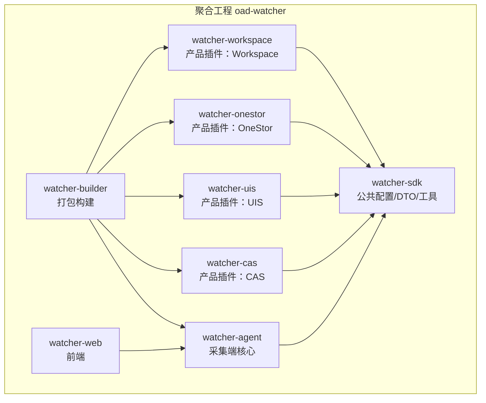
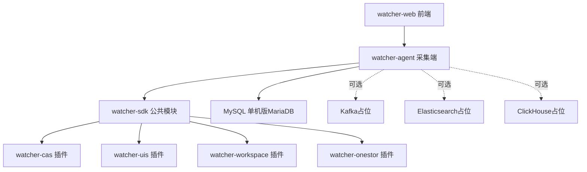
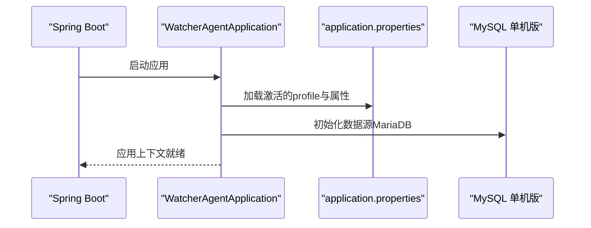
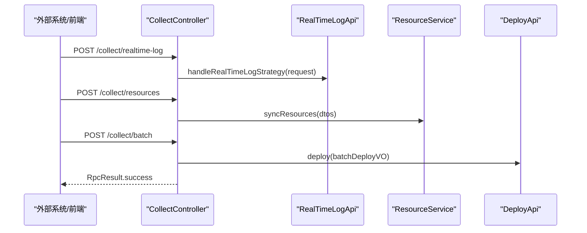
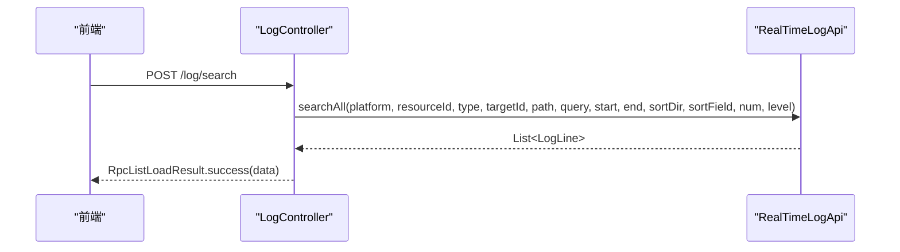
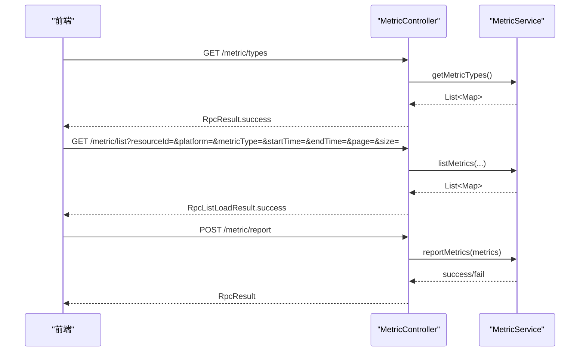
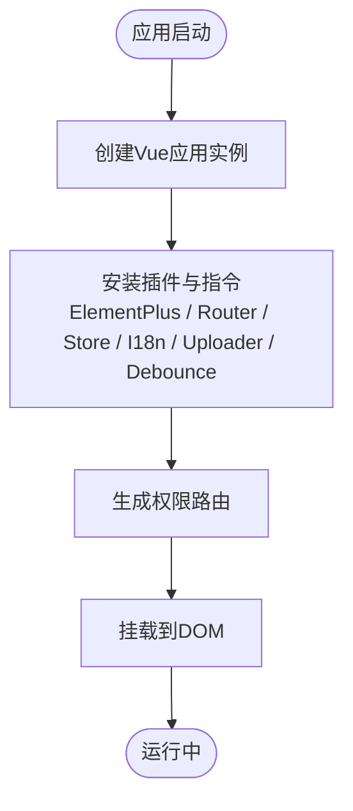
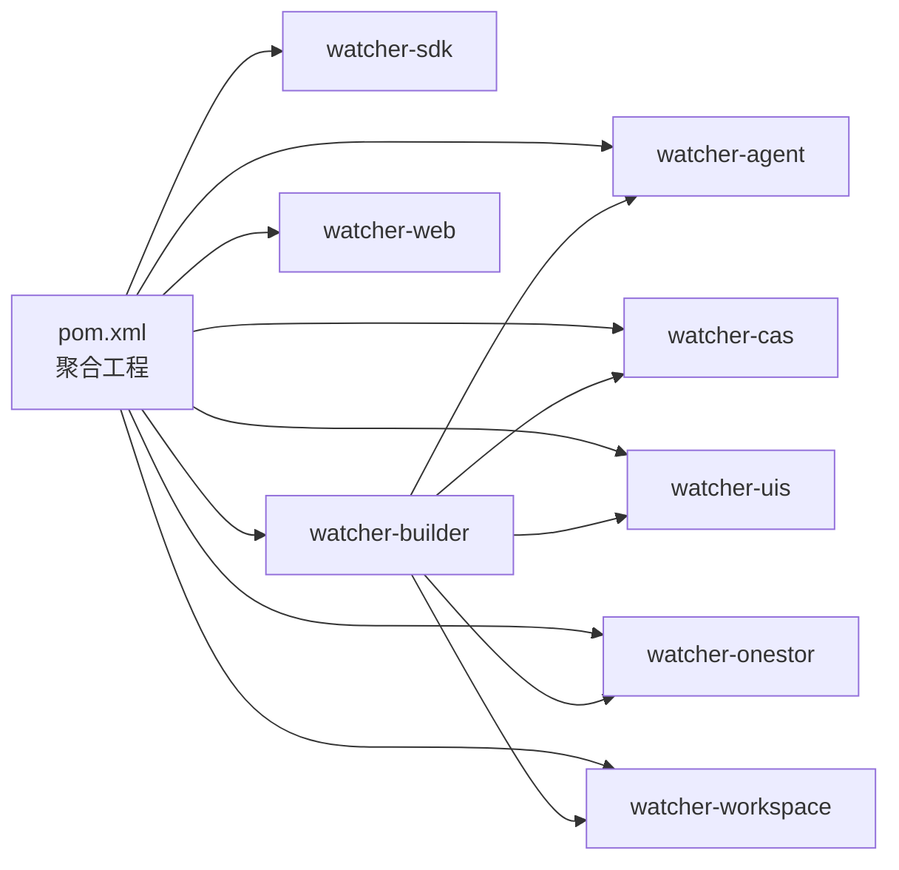

# 项目概述

<cite>
**本文引用的文件**
- [Readme.md](file://Readme.md)
- [pom.xml](file://pom.xml)
- [watcher-agent/src/main/java/com/virtual/cloud/om/agent/WatcherAgentApplication.java](file://watcher-agent/src/main/java/com/virtual/cloud/om/agent/WatcherAgentApplication.java)
- [watcher-agent/src/main/resources/application.properties](file://watcher-agent/src/main/resources/application.properties)
- [watcher-agent/src/main/java/com/virtual/cloud/om/agent/controller/CollectController.java](file://watcher-agent/src/main/java/com/virtual/cloud/om/agent/controller/CollectController.java)
- [watcher-agent/src/main/java/com/virtual/cloud/om/agent/controller/LogController.java](file://watcher-agent/src/main/java/com/virtual/cloud/om/agent/controller/LogController.java)
- [watcher-agent/src/main/java/com/virtual/cloud/om/agent/controller/MetricController.java](file://watcher-agent/src/main/java/com/virtual/cloud/om/agent/controller/MetricController.java)
- [watcher-sdk/pom.xml](file://watcher-sdk/pom.xml)
- [watcher-builder/pom.xml](file://watcher-builder/pom.xml)
- [watcher-cas/pom.xml](file://watcher-cas/pom.xml)
- [watcher-onestor/pom.xml](file://watcher-onestor/pom.xml)
- [watcher-uis/pom.xml](file://watcher-uis/pom.xml)
- [watcher-workspace/pom.xml](file://watcher-workspace/pom.xml)
- [watcher-web/package.json](file://watcher-web/package.json)
- [watcher-web/src/main.ts](file://watcher-web/src/main.ts)
</cite>

## 目录
1. [简介](#简介)
2. [项目结构](#项目结构)
3. [核心组件](#核心组件)
4. [架构总览](#架构总览)
5. [详细组件分析](#详细组件分析)
6. [依赖分析](#依赖分析)
7. [性能考虑](#性能考虑)
8. [故障排查指南](#故障排查指南)
9. [结论](#结论)
10. [附录](#附录)

## 简介
ShowTime监控系统是面向新华三云基产品线的全方位监控组件，定位为“展示（Show）”与“时间序列监控（Time）”。系统围绕日志采集与全文检索、指标采集与监控报表、以及爬虫/知识库等核心能力构建，旨在提供统一的监控与可观测性平台。

- 核心价值与目标
  - 为云基础设施与应用系统提供统一的监控视图，覆盖日志、指标、资源与告警。
  - 支持多产品线插件化扩展（如CAS、UIS、OneStor、Workspace），通过SDK实现能力复用与解耦。
  - 提供采集端与前端的完整链路：采集端负责数据采集与策略下发，前端提供可视化与交互。

- 主要功能特性
  - 日志采集与全文检索：支持实时日志策略下发、批量日志采集与检索。
  - 指标采集与监控报表：支持指标类型枚举、平台类型枚举、指标列表查询、最新指标、趋势曲线与汇总统计。
  - 爬虫/知识库：预留扩展能力，便于接入知识库与智能问答场景。

- 技术栈概览
  - 后端：Spring Boot、Quartz（定时任务）、MyBatis-Plus、Knife4j/Swagger。
  - 存储：MySQL单机版（MariaDB驱动）替代原MongoDB/Kafka/ES/ClickHouse，用于演示与本地开发。
  - 消息与可视化：Kafka（占位）、Elasticsearch（占位）、Kibana（占位）、Grafana（占位）。
  - 前端：Vue 3 + Vite，Element Plus，国际化与权限路由体系。

**章节来源**
- [Readme.md:1-45](file://Readme.md#L1-L45)

## 项目结构
项目采用多模块Maven聚合工程组织，包含采集端、插件模块、SDK、打包构建与前端等子模块。模块划分遵循“采集端为核心、插件为扩展、SDK为公共”的设计原则。

**图表来源**
- [pom.xml:11-20](file://pom.xml#L11-L20)
- [watcher-builder/pom.xml:11-14](file://watcher-builder/pom.xml#L11-L14)

**章节来源**
- [pom.xml:11-20](file://pom.xml#L11-L20)
- [watcher-builder/pom.xml:11-14](file://watcher-builder/pom.xml#L11-L14)

## 核心组件
- 采集端（watcher-agent）
  - 职责：资源管理、定时指标采集、日志策略下发、指标与日志上报接口。
  - 关键接口：采集控制、资源同步、批量部署、日志检索、指标查询与上报。
- 插件模块（watcher-cas/uis/onestor/workspace）
  - 职责：针对不同产品线的日志格式解析、指标采集与告警上报。
  - 依赖：共享SDK，避免重复实现。
- SDK（watcher-sdk）
  - 职责：公共配置、DTO定义、工具类、AOP切面、常量枚举、REST客户端抽象等。
- 打包构建（watcher-builder）
  - 职责：将各模块产物与配置、插件打包为可部署的归档，便于运维部署。
- 前端（watcher-web）
  - 职责：用户界面、路由与权限、国际化、图表与上传组件集成。

**章节来源**
- [watcher-agent/src/main/java/com/virtual/cloud/om/agent/WatcherAgentApplication.java:14-19](file://watcher-agent/src/main/java/com/virtual/cloud/om/agent/WatcherAgentApplication.java#L14-L19)
- [watcher-agent/src/main/java/com/virtual/cloud/om/agent/controller/CollectController.java:30-67](file://watcher-agent/src/main/java/com/virtual/cloud/om/agent/controller/CollectController.java#L30-L67)
- [watcher-agent/src/main/java/com/virtual/cloud/om/agent/controller/LogController.java:21-36](file://watcher-agent/src/main/java/com/virtual/cloud/om/agent/controller/LogController.java#L21-L36)
- [watcher-agent/src/main/java/com/virtual/cloud/om/agent/controller/MetricController.java:24-103](file://watcher-agent/src/main/java/com/virtual/cloud/om/agent/controller/MetricController.java#L24-L103)
- [watcher-sdk/pom.xml:17-160](file://watcher-sdk/pom.xml#L17-L160)
- [watcher-builder/pom.xml:21-206](file://watcher-builder/pom.xml#L21-L206)
- [watcher-web/package.json:20-72](file://watcher-web/package.json#L20-L72)

## 架构总览
系统采用“采集端 + 插件模块 + SDK + 打包构建 + 前端”的分层架构。采集端作为核心服务，通过SDK与各产品插件协作；前端通过HTTP接口与采集端交互，完成监控数据的可视化与操作。

**图表来源**
- [watcher-agent/src/main/resources/application.properties:14-21](file://watcher-agent/src/main/resources/application.properties#L14-L21)
- [watcher-sdk/pom.xml:97-108](file://watcher-sdk/pom.xml#L97-L108)
- [Readme.md:11-26](file://Readme.md#L11-L26)

**章节来源**
- [watcher-agent/src/main/resources/application.properties:14-21](file://watcher-agent/src/main/resources/application.properties#L14-L21)
- [watcher-sdk/pom.xml:97-108](file://watcher-sdk/pom.xml#L97-L108)
- [Readme.md:11-26](file://Readme.md#L11-L26)

## 详细组件分析

### 采集端应用与配置
- 应用入口：启用调度与Mapper扫描，扫描多个包域以加载插件与SDK。
- 配置要点：本地开发默认禁用中间件与插件模块，使用MySQL单机版数据源；可通过profile切换生产配置。

**图表来源**
- [watcher-agent/src/main/java/com/virtual/cloud/om/agent/WatcherAgentApplication.java:24-27](file://watcher-agent/src/main/java/com/virtual/cloud/om/agent/WatcherAgentApplication.java#L24-L27)
- [watcher-agent/src/main/resources/application.properties:48-58](file://watcher-agent/src/main/resources/application.properties#L48-L58)

**章节来源**
- [watcher-agent/src/main/java/com/virtual/cloud/om/agent/WatcherAgentApplication.java:14-19](file://watcher-agent/src/main/java/com/virtual/cloud/om/agent/WatcherAgentApplication.java#L14-L19)
- [watcher-agent/src/main/resources/application.properties:4-21](file://watcher-agent/src/main/resources/application.properties#L4-L21)

### 采集控制与资源管理
- 接口职责：接收实时日志策略、资源同步、批量部署等请求，并委托相应服务处理。
- 设计模式：通过API接口与服务层解耦，便于扩展与测试。

**图表来源**
- [watcher-agent/src/main/java/com/virtual/cloud/om/agent/controller/CollectController.java:45-66](file://watcher-agent/src/main/java/com/virtual/cloud/om/agent/controller/CollectController.java#L45-L66)

**章节来源**
- [watcher-agent/src/main/java/com/virtual/cloud/om/agent/controller/CollectController.java:30-67](file://watcher-agent/src/main/java/com/virtual/cloud/om/agent/controller/CollectController.java#L30-L67)

### 日志检索接口
- 接口职责：根据平台、资源ID、类型、路径、查询条件、时间范围等参数进行日志检索。
- 返回结构：分页结果封装，便于前端展示。

**图表来源**
- [watcher-agent/src/main/java/com/virtual/cloud/om/agent/controller/LogController.java:27-34](file://watcher-agent/src/main/java/com/virtual/cloud/om/agent/controller/LogController.java#L27-L34)

**章节来源**
- [watcher-agent/src/main/java/com/virtual/cloud/om/agent/controller/LogController.java:21-36](file://watcher-agent/src/main/java/com/virtual/cloud/om/agent/controller/LogController.java#L21-L36)

### 指标查询与上报
- 查询能力：支持指标类型与平台枚举、按资源与时间范围查询指标列表、获取最新指标、趋势曲线与汇总统计。
- 上报能力：接收指标数据并落库，异常时返回错误信息。

**图表来源**
- [watcher-agent/src/main/java/com/virtual/cloud/om/agent/controller/MetricController.java:29-101](file://watcher-agent/src/main/java/com/virtual/cloud/om/agent/controller/MetricController.java#L29-L101)

**章节来源**
- [watcher-agent/src/main/java/com/virtual/cloud/om/agent/controller/MetricController.java:24-103](file://watcher-agent/src/main/java/com/virtual/cloud/om/agent/controller/MetricController.java#L24-L103)

### 前端应用与国际化
- 入口配置：Vue 3应用挂载、Element Plus主题、国际化、权限路由、事件总线与指令注册。
- 依赖生态：Axios、ECharts、Element Plus、Vue Router、Vuex、MockJS等。

**图表来源**
- [watcher-web/src/main.ts:24-36](file://watcher-web/src/main.ts#L24-L36)

**章节来源**
- [watcher-web/src/main.ts:1-37](file://watcher-web/src/main.ts#L1-L37)
- [watcher-web/package.json:20-72](file://watcher-web/package.json#L20-L72)

## 依赖分析
- 聚合工程与模块关系
  - 聚合工程统一管理版本与插件，子模块按职责拆分。
- SDK依赖
  - 提供Web、AOP、Swagger、JWT、Jackson/Gson、CSV解析、MyBatis-Plus、MariaDB驱动等基础能力。
- 打包构建
  - 将采集端与各插件的JAR、配置与依赖复制到统一目录，便于部署。

**图表来源**
- [pom.xml:11-20](file://pom.xml#L11-L20)
- [watcher-builder/pom.xml:34-98](file://watcher-builder/pom.xml#L34-L98)

**章节来源**
- [pom.xml:11-20](file://pom.xml#L11-L20)
- [watcher-builder/pom.xml:11-14](file://watcher-builder/pom.xml#L11-L14)

## 性能考虑
- 采集端与插件解耦：通过SDK抽象接口，降低模块间耦合，提升扩展与维护效率。
- 数据访问优化：使用MyBatis-Plus与MariaDB驱动，结合合理的Mapper与SQL映射，减少ORM开销。
- 前端性能：按需引入组件与指令，避免不必要的全局样式与第三方库加载。
- 可选中间件：在本地开发阶段禁用Kafka/ES/ClickHouse，降低启动与运行成本。

[本节为通用建议，无需特定文件引用]

## 故障排查指南
- 启动失败
  - 检查激活的profile与中间件开关，确认本地开发配置是否正确。
  - 确认MySQL单机版数据源URL、用户名与密码。
- 接口异常
  - 查看指标上报接口的异常返回，定位服务层处理逻辑。
  - 检查日志检索接口的参数组合，确保时间范围与查询条件有效。
- 插件未生效
  - 确认插件模块开关与服务地址配置，确保采集端能够访问插件服务。

**章节来源**
- [watcher-agent/src/main/resources/application.properties:14-21](file://watcher-agent/src/main/resources/application.properties#L14-L21)
- [watcher-agent/src/main/resources/application.properties:48-58](file://watcher-agent/src/main/resources/application.properties#L48-L58)
- [watcher-agent/src/main/java/com/virtual/cloud/om/agent/controller/MetricController.java:82-91](file://watcher-agent/src/main/java/com/virtual/cloud/om/agent/controller/MetricController.java#L82-L91)
- [watcher-agent/src/main/java/com/virtual/cloud/om/agent/controller/LogController.java:27-34](file://watcher-agent/src/main/java/com/virtual/cloud/om/agent/controller/LogController.java#L27-L34)

## 结论
ShowTime监控系统以采集端为核心，通过SDK与多插件模块实现对不同产品线的监控扩展，前端提供直观的可视化界面。当前版本在本地开发中采用MySQL单机版替代传统中间件，降低了部署门槛；同时保留了中间件与可视化组件的占位配置，便于后续按需启用。该架构既满足初学者快速上手，也为有经验的开发者提供了清晰的扩展路径与良好的可维护性。

[本节为总结性内容，无需特定文件引用]

## 附录

### 快速开始
- 环境要求
  - JDK 1.8、Node.js >= 14.19.0、MariaDB数据库。
- 安装步骤
  - 后端：使用Maven构建聚合工程，确保各模块编译通过。
  - 前端：安装依赖后启动开发服务器。
  - 部署：使用打包模块生成统一归档，按需启用中间件与插件。
- 基本使用示例
  - 启动采集端应用，访问指标查询接口查看可用指标类型与平台类型。
  - 通过日志检索接口输入查询条件，获取指定时间段内的日志列表。
  - 在前端页面中配置权限路由与国际化，体验多语言与菜单导航。

**章节来源**
- [Readme.md:40-45](file://Readme.md#L40-L45)
- [watcher-web/package.json:17-19](file://watcher-web/package.json#L17-L19)
- [watcher-agent/src/main/resources/application.properties:4-21](file://watcher-agent/src/main/resources/application.properties#L4-L21)