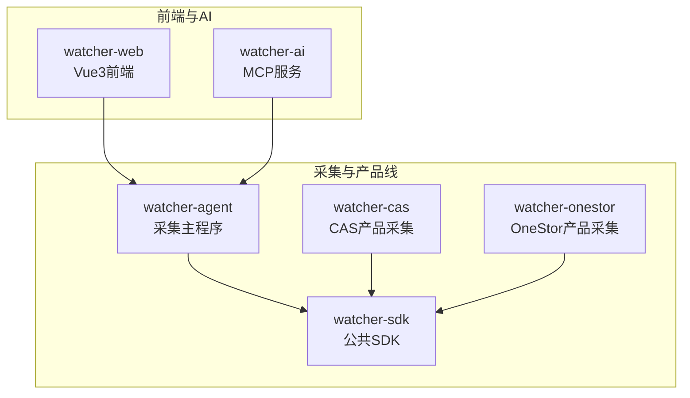
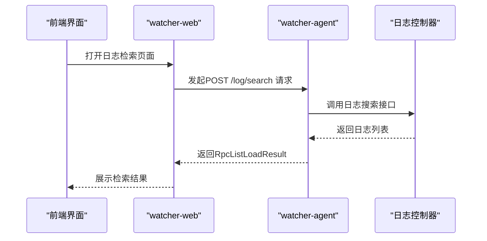
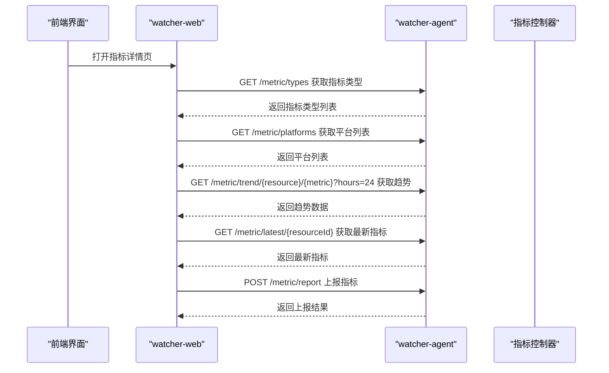
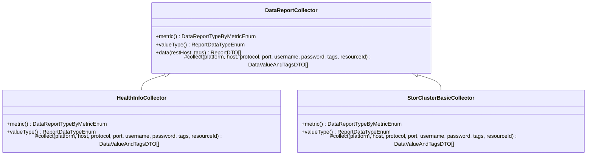
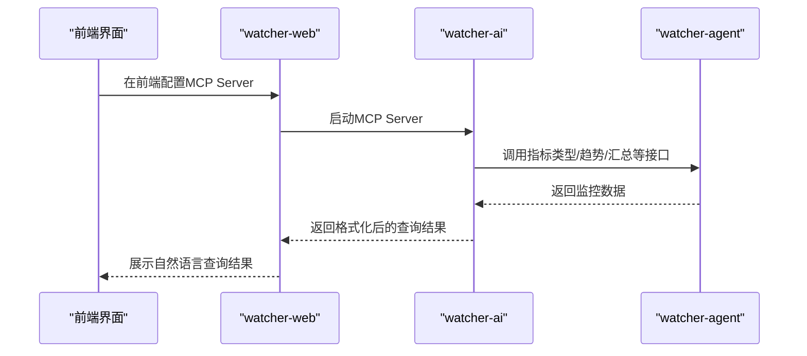

# 项目简介

<cite>
**本文引用的文件**
- [Readme.md](file://Readme.md)
- [pom.xml](file://pom.xml)
- [CollectController.java](file://watcher-agent/src/main/java/com/virtual/cloud/om/agent/controller/CollectController.java)
- [LogController.java](file://watcher-agent/src/main/java/com/virtual/cloud/om/agent/controller/LogController.java)
- [MetricController.java](file://watcher-agent/src/main/java/com/virtual/cloud/om/agent/controller/MetricController.java)
- [DataReportCollector.java](file://watcher-sdk/src/main/java/com/virtual/cloud/om/sdk/api/DataReportCollector.java)
- [HealthInfoCollector.java](file://watcher-cas/src/main/java/com/virtual/cloud/om/cas/service/report/HealthInfoCollector.java)
- [StorClusterBasicCollector.java](file://watcher-onestor/src/main/java/com/virtual/cloud/om/onestor/service/clusterBasic/StorClusterBasicCollector.java)
- [showtime_mcp.py](file://watcher-ai/src/showtime_mcp.py)
- [requirements.txt](file://watcher-ai/requirements.txt)
- [main.ts](file://watcher-web/src/main.ts)
- [package.json](file://watcher-web/package.json)
- [metric.ts](file://watcher-web/src/router/modules/metric.ts)
- [metric-detail.vue](file://watcher-web/src/views/main/metric/metric-detail.vue)
- [es_mapping_serverlog.json](file://watcher-agent/src/main/resources/es_mapping_serverlog.json)
</cite>

## 目录
1. [引言](#引言)
2. [项目结构](#项目结构)
3. [核心组件](#核心组件)
4. [架构总览](#架构总览)
5. [详细组件分析](#详细组件分析)
6. [依赖关系分析](#依赖关系分析)
7. [性能考虑](#性能考虑)
8. [故障排查指南](#故障排查指南)
9. [结论](#结论)
10. [附录](#附录)

## 引言
ShowTime 是新华三云基产品线的全方位监控组件，定位于“展示”与“时间序列”的统一监控平台。其中，“Show”代表对监控结果的可视化展示，“Time”强调对日志、指标等时序数据的采集、存储与分析。系统覆盖日志采集与全文检索、指标采集与监控报表、以及面向未来的爬虫/知识库能力，为企业级监控提供一体化解决方案。

项目名称的含义
- Show：强调“展示”，通过前端界面与图表直观呈现监控数据与报表。
- Time：强调“时间序列”，系统围绕时序数据进行采集、存储与趋势分析。

主要功能特性
- 日志采集与全文检索：支持实时日志策略下发、在线检索与导出，结合全文检索引擎实现高效查询。
- 指标采集与监控报表：提供指标类型枚举、趋势查询、最新指标值、汇总统计等能力，支撑多产品线的指标采集与展示。
- 爬虫/知识库：预留扩展能力，未来可接入爬虫与知识库，增强运维知识沉淀与自动化问答。

应用场景与优势
- 应用场景：适用于云基础设施、存储、虚拟化、网络等多产品线的统一监控与可视化展示；支持多平台、多资源类型的指标与日志统一管理。
- 项目优势：模块化设计清晰、前后端分离、支持多产品线扩展、具备良好的可维护性与可扩展性。

发展历程与版本信息
- 版本：根据前端仓库信息，项目在 2021 年 8 月 10 日正式发布 1.0 版本，并配套基础模板。
- 社区贡献：项目采用开源协议，允许商用与个人研究使用，欢迎社区参与贡献与交流。

章节来源
- [Readme.md:1-45](file://Readme.md#L1-L45)
- [watcher-web/README.md:10-14](file://watcher-web/README.md#L10-L14)

## 项目结构
项目采用 Maven 多模块结构，分为“采集主程序”“公共SDK”“产品线采集模块”“前端界面”“AI MCP 服务”等模块，职责清晰、耦合度低。

模块划分
- watcher-agent：采集主程序，负责资源管理、定时采集、日志策略下发、指标上报与查询接口。
- watcher-sdk：公共模块，包含 DTO、常量、工具类与抽象采集器基类，被各产品线采集模块复用。
- watcher-cas / watcher-uis / watcher-workspace / watcher-onestor：针对不同产品线的指标采集与日志解析实现。
- watcher-web：前端 Vue3 应用，提供资源管理、指标查询、报表展示等界面。
- watcher-ai：MCP 服务，提供 AI Agent 自然语言查询监控数据的能力。
- watcher-builder：打包与部署辅助模块（注意：该模块已移除依赖安装包，需手动准备中间件）。

章节来源
- [Readme.md:27-39](file://Readme.md#L27-L39)
- [pom.xml:11-20](file://pom.xml#L11-L20)

## 核心组件
- 采集控制器（CollectController）：提供资源同步、批量部署、实时日志策略下发等接口，是采集主程序的入口之一。
- 日志控制器（LogController）：提供在线日志检索接口，支持按平台、资源、时间范围等条件查询。
- 指标控制器（MetricController）：提供指标类型、平台枚举、指标列表、最新指标、趋势数据、汇总统计与指标上报等接口。
- 采集抽象器（DataReportCollector）：定义统一的数据采集规范，包括指标类型、值类型、标签与时间戳等，便于各产品线扩展。
- 产品线采集器（如 HealthInfoCollector、StorClusterBasicCollector）：基于抽象器实现具体指标采集逻辑，对接 REST 接口并封装上报数据。
- 前端应用（watcher-web）：基于 Vue3 + Element Plus 构建，提供路由、状态管理、国际化、图表展示等功能。
- AI MCP 服务（watcher-ai）：提供资源、指标、告警等查询工具，支持本地 stdio 与 HTTP 两种传输模式。

章节来源
- [CollectController.java:31-66](file://watcher-agent/src/main/java/com/virtual/cloud/om/agent/controller/CollectController.java#L31-L66)
- [LogController.java:27-34](file://watcher-agent/src/main/java/com/virtual/cloud/om/agent/controller/LogController.java#L27-L34)
- [MetricController.java:29-101](file://watcher-agent/src/main/java/com/virtual/cloud/om/agent/controller/MetricController.java#L29-L101)
- [DataReportCollector.java:19-118](file://watcher-sdk/src/main/java/com/virtual/cloud/om/sdk/api/DataReportCollector.java#L19-L118)
- [HealthInfoCollector.java:26-74](file://watcher-cas/src/main/java/com/virtual/cloud/om/cas/service/report/HealthInfoCollector.java#L26-L74)
- [StorClusterBasicCollector.java:30-76](file://watcher-onestor/src/main/java/com/virtual/cloud/om/onestor/service/clusterBasic/StorClusterBasicCollector.java#L30-L76)
- [main.ts:24-36](file://watcher-web/src/main.ts#L24-L36)
- [showtime_mcp.py:327-490](file://watcher-ai/src/showtime_mcp.py#L327-L490)

## 架构总览
下图展示了后端采集模块、产品线采集模块、公共 SDK、前端界面与 AI MCP 服务之间的关系与交互路径。

图表来源
- [pom.xml:11-20](file://pom.xml#L11-L20)
- [CollectController.java:31-66](file://watcher-agent/src/main/java/com/virtual/cloud/om/agent/controller/CollectController.java#L31-L66)
- [DataReportCollector.java:19-118](file://watcher-sdk/src/main/java/com/virtual/cloud/om/sdk/api/DataReportCollector.java#L19-L118)
- [HealthInfoCollector.java:26-74](file://watcher-cas/src/main/java/com/virtual/cloud/om/cas/service/report/HealthInfoCollector.java#L26-L74)
- [StorClusterBasicCollector.java:30-76](file://watcher-onestor/src/main/java/com/virtual/cloud/om/onestor/service/clusterBasic/StorClusterBasicCollector.java#L30-L76)
- [main.ts:24-36](file://watcher-web/src/main.ts#L24-L36)
- [showtime_mcp.py:327-490](file://watcher-ai/src/showtime_mcp.py#L327-L490)

## 详细组件分析

### 采集与日志检索流程
该流程描述了从前端发起日志检索请求，到采集主程序调用日志接口完成查询并返回结果的关键步骤。

图表来源
- [LogController.java:27-34](file://watcher-agent/src/main/java/com/virtual/cloud/om/agent/controller/LogController.java#L27-L34)
- [main.ts:24-36](file://watcher-web/src/main.ts#L24-L36)

章节来源
- [LogController.java:27-34](file://watcher-agent/src/main/java/com/virtual/cloud/om/agent/controller/LogController.java#L27-L34)

### 指标查询与上报流程
该流程展示了前端如何查询指标类型、平台、趋势与最新指标，以及如何上报指标数据。

图表来源
- [MetricController.java:29-101](file://watcher-agent/src/main/java/com/virtual/cloud/om/agent/controller/MetricController.java#L29-L101)
- [metric.ts:5-24](file://watcher-web/src/router/modules/metric.ts#L5-L24)
- [metric-detail.vue:34-66](file://watcher-web/src/views/main/metric/metric-detail.vue#L34-L66)

章节来源
- [MetricController.java:29-101](file://watcher-agent/src/main/java/com/virtual/cloud/om/agent/controller/MetricController.java#L29-L101)
- [metric.ts:5-24](file://watcher-web/src/router/modules/metric.ts#L5-L24)
- [metric-detail.vue:34-66](file://watcher-web/src/views/main/metric/metric-detail.vue#L34-L66)

### 采集抽象器与产品线采集器
采集抽象器定义了统一的数据采集规范，产品线采集器基于该规范实现具体指标采集逻辑。

图表来源
- [DataReportCollector.java:19-118](file://watcher-sdk/src/main/java/com/virtual/cloud/om/sdk/api/DataReportCollector.java#L19-L118)
- [HealthInfoCollector.java:26-74](file://watcher-cas/src/main/java/com/virtual/cloud/om/cas/service/report/HealthInfoCollector.java#L26-L74)
- [StorClusterBasicCollector.java:30-76](file://watcher-onestor/src/main/java/com/virtual/cloud/om/onestor/service/clusterBasic/StorClusterBasicCollector.java#L30-L76)

章节来源
- [DataReportCollector.java:19-118](file://watcher-sdk/src/main/java/com/virtual/cloud/om/sdk/api/DataReportCollector.java#L19-L118)
- [HealthInfoCollector.java:26-74](file://watcher-cas/src/main/java/com/virtual/cloud/om/cas/service/report/HealthInfoCollector.java#L26-L74)
- [StorClusterBasicCollector.java:30-76](file://watcher-onestor/src/main/java/com/virtual/cloud/om/onestor/service/clusterBasic/StorClusterBasicCollector.java#L30-L76)

### AI MCP 服务与前端集成
AI MCP 服务提供自然语言查询监控数据的工具，前端可通过配置启用 MCP Server，实现与 AI Agent 的无缝集成。

图表来源
- [showtime_mcp.py:327-490](file://watcher-ai/src/showtime_mcp.py#L327-L490)
- [requirements.txt:1-5](file://watcher-ai/requirements.txt#L1-L5)
- [main.ts:24-36](file://watcher-web/src/main.ts#L24-L36)

章节来源
- [showtime_mcp.py:327-490](file://watcher-ai/src/showtime_mcp.py#L327-L490)
- [requirements.txt:1-5](file://watcher-ai/requirements.txt#L1-L5)
- [main.ts:24-36](file://watcher-web/src/main.ts#L24-L36)

## 依赖关系分析
- 后端技术栈：Spring Boot、Quartz、MongoDB、Elasticsearch、Kafka、Filebeat、ClickHouse、Grafana 等。
- 前端技术栈：Vue3、Element Plus、Vite、Axios、Vuex、Vue Router 等。
- AI MCP 依赖：FastMCP、HTTPX、Pydantic、python-dotenv 等。

章节来源
- [Readme.md:11-26](file://Readme.md#L11-L26)
- [package.json:20-54](file://watcher-web/package.json#L20-L54)
- [requirements.txt:1-5](file://watcher-ai/requirements.txt#L1-L5)

## 性能考虑
- 指标存储与查询：建议结合列式数据库与时序数据库进行优化，提升大规模时序数据的写入与查询性能。
- 日志检索：合理设置索引映射与分片副本数，避免全量扫描导致的延迟。
- 前端渲染：对大表格与图表进行分页与懒加载，减少一次性渲染压力。
- 并发与线程池：利用公共 SDK 中的线程池与异步执行策略，提高采集与上报吞吐量。

## 故障排查指南
- 日志检索无结果
  - 检查日志检索接口参数是否正确（平台、资源、时间范围等）。
  - 确认日志索引映射配置与目标字段一致。
- 指标上报失败
  - 查看指标上报接口返回状态与错误信息，确认资源是否存在与指标类型是否匹配。
  - 检查采集器实现是否正确设置指标类型与值类型。
- 前端无法访问后端接口
  - 检查跨域配置与路由权限，确保前端能正常请求后端接口。
- AI MCP 无法连接后端
  - 检查 MCP 服务的环境变量与后端 API 地址配置，确认网络连通性。

章节来源
- [LogController.java:27-34](file://watcher-agent/src/main/java/com/virtual/cloud/om/agent/controller/LogController.java#L27-L34)
- [MetricController.java:80-91](file://watcher-agent/src/main/java/com/virtual/cloud/om/agent/controller/MetricController.java#L80-L91)
- [main.ts:24-36](file://watcher-web/src/main.ts#L24-L36)
- [es_mapping_serverlog.json:113-154](file://watcher-agent/src/main/resources/es_mapping_serverlog.json#L113-L154)

## 结论
ShowTime 以“展示”和“时间序列”为核心理念，构建了覆盖日志、指标与报表的统一监控平台。其模块化架构与多产品线采集能力，使其在企业监控领域具备良好的扩展性与实用性。配合前端可视化与 AI MCP 能力，能够进一步提升运维效率与智能化水平。

## 附录
- 版本信息：项目于 2021 年 8 月 10 日发布 1.0 版本。
- 社区与交流：项目允许商用与个人研究使用，欢迎通过社区渠道参与贡献与交流。

章节来源
- [watcher-web/README.md:10-14](file://watcher-web/README.md#L10-L14)